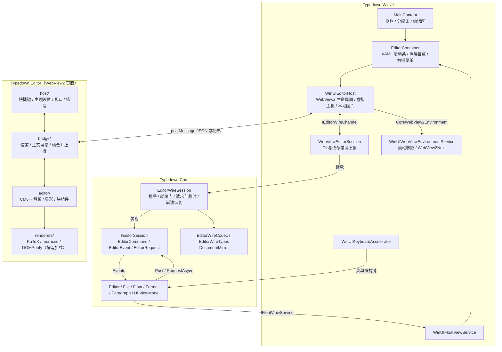
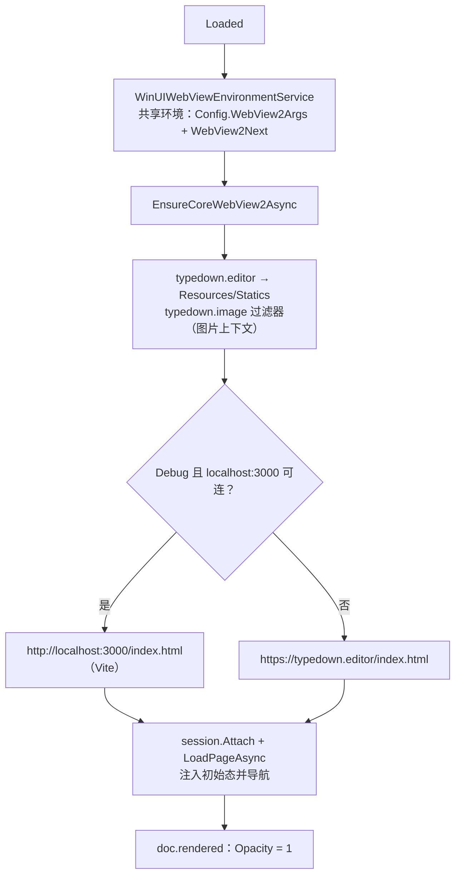
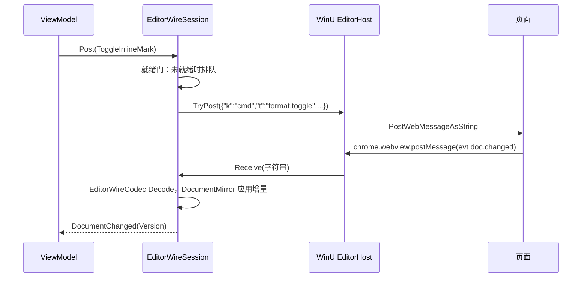
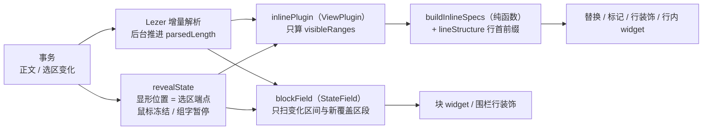
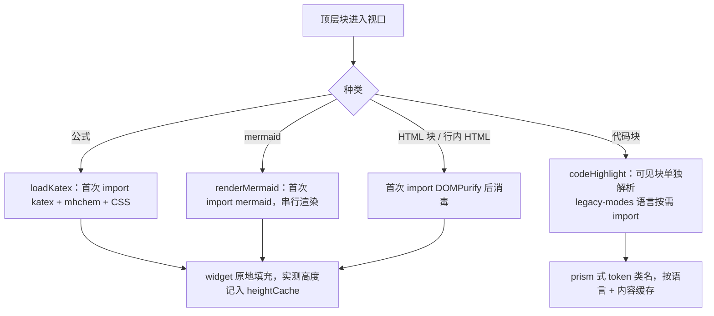
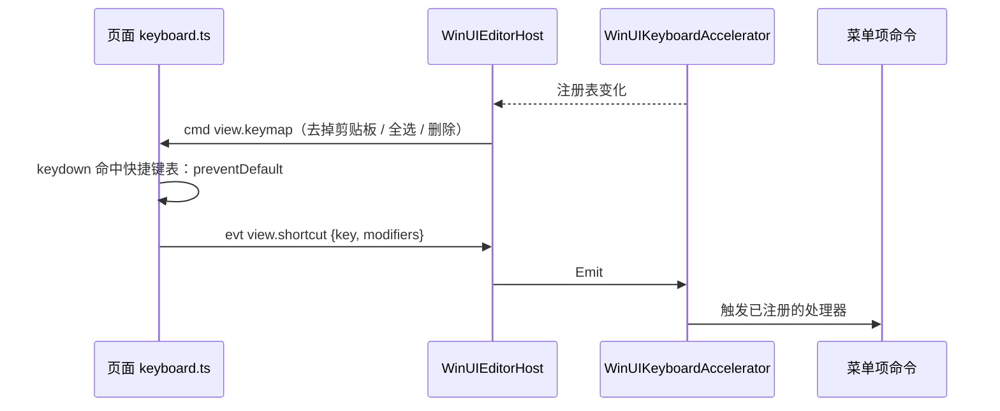
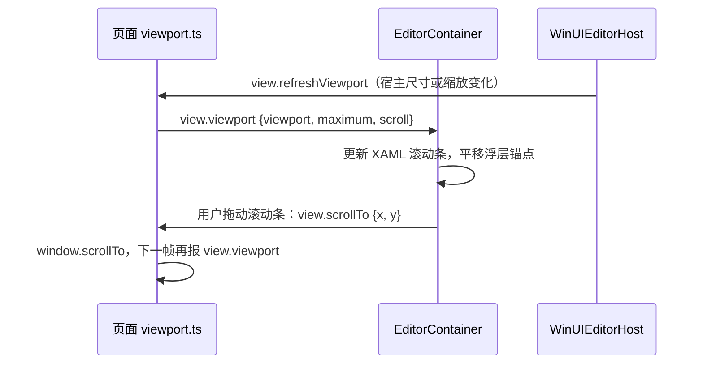
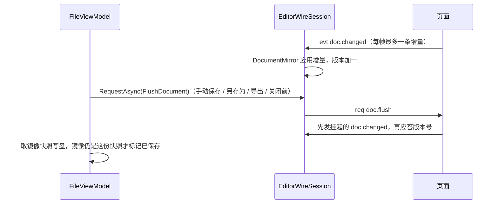

# Typedown 当前架构

## 概念

| 术语 | 含义 |
|---|---|
| 宿主 | WinUI3 应用本体 [Typedown.WinUI](/Dev/Typedown.WinUI/)，负责窗口、菜单、文件、设置和所有 XAML 浮层 |
| 页面 | 运行在 WebView2 里的编辑器 [Typedown.Editor](/Dev/Typedown.Editor/)：CodeMirror 6（CM6）加自建的 Typora 式所见即所得层，负责正文的解析、渲染与编辑 |
| 编辑会话 | Core 里的强类型契约 [IEditorSession](/Dev/Typedown.Core/Editor/IEditorSession.cs)：ViewModel 只通过它投递命令（`EditorCommand`）、订阅事件（`EditorEvent`）、发起请求（`EditorRequest<T>`），不接触报文与 JSON |
| 线协议 | 宿主与页面之间经 `postMessage` 传递的 JSON 报文格式，全文见 [editor-protocol.md](editor-protocol.md) |
| 正文镜像 | 宿主持有的一份正文副本与版本号，保存、备份、脏标记、崩溃恢复都读它；正文的真相在页面 |
| 显形 | Typora 式编辑的核心规则：光标所在处露出 Markdown 标记（变灰），其余位置隐藏标记、显示渲染结果 |
| 块组件 | 整块换成渲染结果的顶层块：表格、公式、mermaid、代码块的框、front matter、HTML 块、`[TOC]`、脚注定义 |
| 宿主浮层 | 页面只上报锚点与上下文，由宿主用 XAML Flyout 画出的浮动 UI（段落菜单、表格工具、图片工具、链接提示、右键菜单等） |
| 快捷键表 | 宿主当前认领的全部快捷键和弦，下发给页面用于在页面内拦截 |

## 架构

每个窗口独占一个进程。进程内由 Core 的 ViewModel 持有应用状态，经 `IEditorSession` 驱动编辑器；契约的实现是 Core 里不含 WebView2 代码的 `EditorWireSession`，WinUI 的 `WebViewEditorSession` 继承它、只接上 DI 与错误上报；`WinUIEditorHost` 以 `IEditorWireChannel` 的身份承载 WebView2，把报文字符串送进送出。页面由 https 虚拟主机 `typedown.editor` 装载，本地图片走另一个虚拟主机 `typedown.image`。

## 分点解释

### 1. 工程与分层

| 工程 | 职责 |
|---|---|
| [Typedown.Core](/Dev/Typedown.Core/) | 模型、配置、持久化、编辑会话契约（[Editor](/Dev/Typedown.Core/Editor/)）、新引擎线协议的编解码、正文镜像与会话实现（[Editor/Wire](/Dev/Typedown.Core/Editor/Wire/)）、旧 Muya 协议的编解码（[Editor/Legacy](/Dev/Typedown.Core/Editor/Legacy/)，随 `LegacyMuyaSession` 保留、不再使用）、ViewModel 与平台抽象接口（`IFloatViewService`、`IKeyboardAccelerator` 等）；AnyCPU、`IsAotCompatible`，全部 JSON 走 System.Text.Json 源生成，不引用 Newtonsoft、WinUI / Windows SDK 投影，不含任何 UI 类型 |
| [Typedown.WinUI](/Dev/Typedown.WinUI/) | 入口、窗口、XAML 控件与页面，实现 Core 的平台接口与 `IEditorWireChannel`；`Release` 以 Native AOT 发布，裁剪与 AOT 诊断在所有配置下都是错误（见 [build.md](build.md) 第 5 节） |
| [Typedown.Editor](/Dev/Typedown.Editor/) | 页面前端：Vite + TypeScript + CM6，Yarn 1，单测用 Vitest；生产构建输出到 `Dev/Typedown.WinUI/Resources/Statics`（gitignore），`build:bench` 另出带 `dev.html` 的 `dist-bench/` 供工具测量 |
| [Tests](/Tests/) | `ArchitectureTests` 守护分层，`CoreTests` 覆盖 Core（含线协议会话 [EditorWireSessionTests](/Tests/Typedown.CoreTests/Editor/EditorWireSessionTests.cs)） |
| [Tools](/Tools/) | [perf-probe](/Tools/perf-probe/run.mjs) 是无头 Edge 上的性能与保真探针，[style-parity](/Tools/style-parity/run.mjs) 逐块对比新页面与旧 Muya 页面的排版数值；另有翻译工具与 XAML 设计器 |

依赖方向由 [LayerDependencyGuardTests](/Tests/Typedown.ArchitectureTests/Guards/LayerDependencyGuardTests.cs) 与 [CleanArchitectureGuardTests](/Tests/Typedown.ArchitectureTests/Guards/CleanArchitectureGuardTests.cs) 强制，会话契约的形状（六个成员、命令事件无 `object` / `JsonElement` 字段、ViewModel 不碰 Newtonsoft）由 [EditorContractGuardTests](/Tests/Typedown.ArchitectureTests/Guards/EditorContractGuardTests.cs) 守住：Core 不引用 WinUI 与 Editor，也不得引用 `Microsoft.UI.*` / `Microsoft.WinUI`、Windows SDK 投影（`Microsoft.Windows.SDK.NET`、`WinRT.Runtime`、`Windows.*`）、`Microsoft.Web.WebView2` 与 `SkiaSharp`。工程只分两层，唯一的边界是「有没有平台 UI 类型」：ViewModel 与协议会话不碰平台类型、可脱离 WinUI 测试，所以与模型同在 Core。

### 2. 进程、窗口与 DI 作用域

[Program.cs](/Dev/Typedown.WinUI/Program.cs) 用 `AppInstance` 做单实例：普通激活（如双击 .md）会重定向给主实例；「新窗口」由 [App.xaml.cs](/Dev/Typedown.WinUI/App.xaml.cs) 带 `--typedown-new-window` 参数另起一个进程，所以窗口与进程一一对应。进程内只创建一个 `uiScope`，所有 Scoped 注册（ViewModel、`WebViewEditorSession` 及其 `IEditorSession` 别名、`IKeyboardAccelerator`、`IFloatViewService` 等）实际上都是进程级单例，按 Scoped 注册只是表达「属于窗口」的语义。编辑会话的注册在 [App.xaml.cs#L136-L138](/Dev/Typedown.WinUI/App.xaml.cs#L136-L138)；[LegacyMuyaSession](/Dev/Typedown.WinUI/Controls/EditorControls/Hosting/LegacyMuyaSession.cs) 与旧协议代码仍在仓库里，但不再注册。

会话回问应用状态的几项（启动设置与正文、建表尺寸对话框、写剪贴板、图片基准目录）经 [IEditorHostCallbacks](/Dev/Typedown.Core/Editor/IEditorHostCallbacks.cs) 交给 `EditorViewModel`。ViewModel 在构造时订阅 `Session.Events`，而页面一装载就会报选区、字数与目录，所以 `WinUIEditorHost` 构造时先解析各 ViewModel，保证订阅在第一条事件前就位。

### 3. 编辑器宿主

[WinUIEditorHost](/Dev/Typedown.WinUI/Controls/EditorControls/Hosting/WinUIEditorHost.cs) 负责 WebView2 的生命周期、页面装载、本地图片与输入，不持有正文、不认识报文类型：收到的报文字符串原样交给会话的 `Receive`，会话要发的报文经 `IEditorWireChannel.TryPost` 以 `PostWebMessageAsString` 投出；初始态脚本的注入与导航也由会话经 `IEditorWireChannel.NavigateAsync` 发起。宿主 `Loaded` 时 `Attach`、`Unloaded` 时 `Detach`（打开设置页时整页卸载，页面与会话都还活着），导航开始与渲染进程退出也通知会话。

- **WebView2 环境。** 环境只由 [WinUIWebViewEnvironmentService](/Dev/Typedown.WinUI/Services/WinUIWebViewEnvironmentService.cs) 创建，`App.OnLaunched` 早早开始预热。启动参数取自 [Config.cs#L21-L28](/Dev/Typedown.Core/Config.cs#L21-L28) 的 `WebView2Args`，只有滚动条样式需要的 `msOverlayScrollbarWinStyle` 特性开关，不再放开跨域与 `file://` 访问（Debug 另加远程调试端口 9222）。同一用户数据目录下的所有 WebView2 必须用同一组参数，所以用户数据目录是应用本地数据目录下的 `WebView2Next`（[Config.cs#L30-L34](/Dev/Typedown.Core/Config.cs#L30-L34)），与旧 Muya 构建的目录分开。
- **页面装载。** 宿主把主机名 `typedown.editor` 映射到输出目录的 `Resources/Statics`（`SetVirtualHostNameToFolderMapping`；找不到时沿目录向上找仓库里的 `Dev/Typedown.WinUI/Resources/Statics`），入口 `https://typedown.editor/index.html`；Debug 构建先用 200 ms 探测 Vite 开发服务器。产物缺失时记日志并直接显示空白 WebView。编辑器页面以外的导航（页面里的链接、拖进来的文件）一律取消，链接由页面以 `view.openLink` 交给宿主打开。
- **本地图片。** 页面把本地图片改写成 `https://typedown.image/<盘符>/<路径段>`，宿主用 `AddWebResourceRequestedFilter` 只拦图片上下文的请求，路径校验在 Core 的 [LocalImageRequest](/Dev/Typedown.Core/Editor/Wire/LocalImageRequest.cs)，读文件放到线程池；改写与校验规则见 [editor-protocol.md](editor-protocol.md) 第 3 节。
- **首帧与背景。** `DefaultBackgroundColor` 在导航前就设成主题背景色，WebView 在页面报 `doc.rendered` 之前保持透明（`Opacity = 0`），所以不出现白闪与空编辑区的一帧；会话进入 `Faulted`、导航失败或渲染进程出错时直接显示。主题由 [EditorThemeFactory](/Dev/Typedown.WinUI/Controls/EditorControls/Hosting/EditorThemeFactory.cs) 按 `ElementTheme` 统一生成（明暗、系统强调色、实色背景），编辑区不透 Mica。
- **WebView2 设置。** 浏览器快捷键、缩放控件、状态栏与内置错误页关闭；默认右键菜单保持启用（见第 8 节）；开发者工具只在 Debug 打开。

### 4. 编辑会话与线协议

契约与实现分三层：[IEditorSession](/Dev/Typedown.Core/Editor/IEditorSession.cs) 是 ViewModel 唯一认识的形状；[EditorWireSession](/Dev/Typedown.Core/Editor/Wire/EditorWireSession.cs) 在 Core 里实现全部协议逻辑（启动握手、就绪门 [EditorCommandGate](/Dev/Typedown.Core/Editor/EditorCommandGate.cs)、正文镜像 [DocumentMirror](/Dev/Typedown.Core/Editor/Wire/DocumentMirror.cs) 与重同步、双向请求与超时、[EditorCrashRecovery](/Dev/Typedown.Core/Editor/EditorCrashRecovery.cs) 驱动的重载），单测用假通道驱动；[WebViewEditorSession](/Dev/Typedown.WinUI/Controls/EditorControls/Hosting/WebViewEditorSession.cs) 继承它，只从 DI 取回调、把页面的致命错误按 `message + stack` 去重后远程上报。

契约 record 的属性就是载荷字段，类型名与 record 的双射集中在 [EditorWireTypes](/Dev/Typedown.Core/Editor/Wire/EditorWireTypes.cs)，编解码在无状态的 [EditorWireCodec](/Dev/Typedown.Core/Editor/Wire/EditorWireCodec.cs)，载荷经 [EditorWireJsonContext](/Dev/Typedown.Core/Editor/Wire/EditorWireJsonContext.cs) 源生成序列化。只有生命周期、正文同步与回问宿主的几条报文由会话自己消化。信封与 JSON 约定、握手时序、正文增量、消息清单、频率规则、浮层坐标、错误与版本演进都以 [editor-protocol.md](editor-protocol.md) 为准，本文不重复。

### 5. 编辑器页面

页面是一份 ES 模块产物，`base` 取相对路径，所以虚拟主机与 Vite 开发服务器用同一份产物。入口 [main.ts](/Dev/Typedown.Editor/src/main.ts) 取 `chrome.webview` 做传输（普通浏览器里换成假宿主、装一篇空文档），读导航前注入的 `window.__typedownInit`，交给 [app.ts](/Dev/Typedown.Editor/src/app.ts) 装配：按初始态建 CM6 视图，接上信道与各上报器，然后发 `lifecycle.ready`。dev 页 [devPage.ts](/Dev/Typedown.Editor/src/dev/devPage.ts) 走同一条装配路径，只是换成假宿主并载入示例文档，性能探针测到的就是宿主下的按键路径。

| 目录 | 职责 |
|---|---|
| [bridge/](/Dev/Typedown.Editor/src/bridge/) | 线协议的页面侧：类型名与载荷（`protocol.ts`）、信道与请求应答（`channel.ts`）、正文增量与 flush（`docSync.ts`）、按帧合并的事件出口（`frame.ts`）、「变化才发」的状态上报（`reporters.ts`） |
| [host/](/Dev/Typedown.Editor/src/host/) | 与宿主配合的页面行为：快捷键桥（`keyboard.ts`）、主题与设置（`theme.ts`）、视口上报与宿主滚动（`viewport.ts`）、错误上报（`fault.ts`） |
| [editor/syntax/](/Dev/Typedown.Editor/src/editor/syntax/) | Lezer Markdown 语法与自有扩展（公式、高亮、中文强调、front matter、脚注、`[TOC]`）、围栏代码的语言清单 |
| [editor/decorations/](/Dev/Typedown.Editor/src/editor/decorations/) | 行内显形：决策层、ViewPlugin、行首块结构、光标规范位置、链接、显形的暂停条件 |
| [editor/widgets/](/Dev/Typedown.Editor/src/editor/widgets/) | 块组件 StateField 与各类 widget（表格网格、公式、图表、图片、围栏框）、widget 高度缓存 |
| [editor/blocks/](/Dev/Typedown.Editor/src/editor/blocks/) | 块组件的配套行为：代码高亮、围栏保护、语言补全、退出公式 / 图表编辑态 |
| [editor/state/](/Dev/Typedown.Editor/src/editor/state/) | 由文档派生的状态：大纲、脚注编号、字数、选区信息、解析进度 |
| [renderers/](/Dev/Typedown.Editor/src/renderers/) | KaTeX、mermaid、HTML 消毒（DOMPurify）的按需加载，本地图片地址改写 |
| [styles/](/Dev/Typedown.Editor/src/styles/) | 主题变量、正文排版、行内元素、块组件、prism 代码配色，数值对齐旧 Muya 页面（由 style-parity 核对） |

### 6. 解析与显形

正文只有一份 CM6 文档，渲染全部是装饰：隐藏标记用替换装饰，渲染结果用 widget，块级样式用行装饰。解析由 `@codemirror/language` 增量进行，默认后台只推进到视口之后一段，[parseProgress.ts](/Dev/Typedown.Editor/src/editor/state/parseProgress.ts) 给出语法树已覆盖的长度，覆盖不到的部分按源码显示、解析推进后补齐。

- **行内显形。** [inlinePlugin.ts](/Dev/Typedown.Editor/src/editor/decorations/inlinePlugin.ts) 只对可见区间调用决策层 [inlineSpecs.ts](/Dev/Typedown.Editor/src/editor/decorations/inlineSpecs.ts)：显形位置落在某个行内 span（强调、行内代码、链接、行内公式、emoji、脚注引用、行内 HTML）上时露出标记并变灰，否则隐藏标记或换成渲染 widget，隐藏区间登记为原子范围。决策层是与视图无关的纯函数，单测直接断言它的输出。
- **行首块结构。** 列表、任务、引用的行首前缀由 [lineStructure.ts](/Dev/Typedown.Editor/src/editor/decorations/lineStructure.ts) 按行求出：带符号的前缀整段换成列表符号或任务框 widget（列表符号是宽度为 0 的行内块里放一个空 `<li>`，由浏览器画出与旧编辑器真实列表相同的符号），其余前缀直接隐藏；缩进层数、引用竖线、已完成任务是行装饰。光标不会停在前缀里，由 [canonical.ts](/Dev/Typedown.Editor/src/editor/decorations/canonical.ts) 在事务过滤里规范到前缀末尾；标题、链接、强调边缘也各有规范位置。
- **暂停条件。** [revealState.ts](/Dev/Typedown.Editor/src/editor/decorations/revealState.ts) 定义两种暂停：鼠标按下到松开后约 100 ms 内不随选区重算（否则显形引起的位移会把单击变成拖选），输入法组字期间只映射装饰、组字结束后补算一次。行内显形与块组件共用这两条。
- **块级样式只看语法。** 标题字号、引用、列表缩进、段间空行高度（[blockSpacing.ts](/Dev/Typedown.Editor/src/editor/decorations/blockSpacing.ts) 按旧编辑器相邻块的外边距折叠结果给出）不随显形变化，避免行高跳动。

### 7. 块组件与按需加载

块级 widget 会影响纵向布局，只能由 StateField 提供。[blockField.ts](/Dev/Typedown.Editor/src/editor/widgets/blockField.ts) 只处理顶层块，按变化区间增量维护：重扫变化区间、覆盖它的顶层块与新旧显形位置所在的块，其余按变化映射；后台解析推进时补扫新覆盖的区段；依赖全文索引的块（`[TOC]` 依赖大纲、脚注定义依赖编号）在索引变化时一并重扫。光标进入公式、mermaid、HTML 块与 `[TOC]` 时切成源码编辑态，表格始终是网格，代码块与 front matter 始终可编辑、只画框。列表与引用里的代码块、公式块按源码显示。

- **按需加载。** 主包只含打开纯文字文档所需的 CM6 核心与自有代码（[vite.config.ts](/Dev/Typedown.Editor/vite.config.ts) 把 CM6 与 Lezer 分进 `editor-core` 组），KaTeX、mermaid、DOMPurify 与 legacy-modes 的代码语言都在首次需要时 `import()`，加载前以源码或占位显示。
- **高度稳定。** 公式与图表的真实高度要渲染后才知道，[heightCache.ts](/Dev/Typedown.Editor/src/editor/widgets/heightCache.ts) 按内容哈希缓存实测高度，视口外的块用缓存高度参与 CM6 的高度估算，滚动回来时不再跳动。
- **代码高亮。** [codeHighlight.ts](/Dev/Typedown.Editor/src/editor/blocks/codeHighlight.ts) 不开全局嵌套解析，只对视口内的代码块按语言单独解析、按「语言 + 内容」缓存，按键时只重解析被编辑的那一块；过大的块不高亮。
- **表格。** [tableWidget.ts](/Dev/Typedown.Editor/src/editor/widgets/tableWidget.ts) 把顶层表格换成网格，每个单元格可编辑，输入只替换该单元格的源码区间，组字结束时提交。

### 8. 快捷键与右键菜单

WinUI3 的 WebView2 独占键盘与指针输入，焦点在编辑器里时 XAML 收不到 `KeyDown`，也看不到右键。快捷键全部由菜单项经 `IKeyboardAccelerator.Register` 注册（用户可在设置里改），[WinUIKeyboardAccelerator](/Dev/Typedown.WinUI/Services/WinUIKeyboardAccelerator.cs) 维护一张带引用计数的和弦表，表一变化宿主就以 `SetKeymap` 下发；页面的 [keyboard.ts](/Dev/Typedown.Editor/src/host/keyboard.ts) 在捕获阶段比对，命中就拦下并以 `view.shortcut` 回报，宿主补触发对应命令（Ctrl+Z 即 `Undo`）。剪贴板、全选、删除的和弦不下发，交给浏览器与 CM6 原生处理。输入法组字、已被处理的事件、单按修饰键一律放行。

右键走原生路径：`AreDefaultContextMenusEnabled` 保持开启，`CoreWebView2.ContextMenuRequested` 触发后宿主置 `Handled = true` 抑制浏览器菜单，用 `ContextAt` 请求问页面点击处的上下文（失败或超时按未知处理，退回按当前选区），再由 [EditorContainer](/Dev/Typedown.WinUI/Controls/EditorControls/EditorContainer.xaml.cs) 在同一位置弹出 XAML `MenuFlyout`。页面不能对 contextmenu 调 `preventDefault`，否则这个事件不会触发。Ctrl+滚轮由 `EditorContainer` 在 XAML 一侧处理，调整的是设置里的字号，不是 WebView 缩放。

### 9. 宿主浮层与坐标

页面需要浮动 UI 时只发 `float.*` 事件，载荷里带锚点矩形（CSS px，相对 WebView 视口）与上下文；`FloatViewModel` 交给 [WinUIFloatViewService](/Dev/Typedown.WinUI/Services/WinUIFloatViewService.cs)，后者用 `EditorContainer.GetFloatAnchor` 把一个不可见锚点摆到该矩形上，再把 Flyout 挂在锚点上（宿主从不修改 `ZoomFactor`，CSS px 与 XAML 的 DIP 相同）；用户操作以命令回传页面，页面滚动时锚点按 `view.viewport` 的滚动差平移。输入中跟随光标的补全列表（代码块语言、`:emoji:`）是唯一留在页面里的浮层，因为 Flyout 会拿走 WebView 的键盘焦点、打断组字。时序与坐标换算见 [editor-protocol.md](editor-protocol.md) 第 7 节。

### 10. 滚动条与编辑区宽度

页面原生滚动条在宿主里隐藏（根元素带 `td-host` 类），横竖两条滚动条都是 `EditorContainer` 里的 XAML `ScrollBar`。CM6 不设固定高度、以窗口为滚动容器；页面 [viewport.ts](/Dev/Typedown.Editor/src/host/viewport.ts) 在尺寸或滚动变化时于下一帧上报 `view.viewport`（视口尺寸、可滚动量、当前位置），拖动 XAML 滚动条时宿主以 `view.scrollTo` 让页面 `scrollTo`。WebView2 在 XAML 布局之后才异步更新内核视口，所以宿主尺寸变化、`XamlRoot` 缩放变化（跨显示器）与首屏 `doc.rendered` 后，宿主都发 `view.refreshViewport` 请页面补报。分数缩放下不超过 1 px 的溢出按 0 处理。细节见 [editor-protocol.md](editor-protocol.md) 第 8 节。

页面 `body` 有 `min-width: 400px`，视口再窄只能横向溢出；[MainContent](/Dev/Typedown.WinUI/Controls/EditorControls/MainContent.xaml.cs) 给编辑区列设动态下限 `min(400, 可用宽度)`，让分隔条压不窄编辑区（`GridSplitter` 会校验相邻列的 `MinWidth`），窗口本身太窄时则不硬撑，免得 Grid 裁掉编辑区和竖向滚动条。版心宽度来自设置，由页面写进 CSS 变量 `--editorAreaWidth`。

### 11. 文档状态与撤销

[FileViewModel](/Dev/Typedown.Core/ViewModels/FileViewModel.cs) 打开、新建文档时同步写入路径、正文与哈希，并经 `EditorViewModel.LoadDocument` 投递 `LoadDocument(text, basePath)`：会话据此重置正文镜像，页面就绪后发 `doc.load`。读文件经 [TextFileCodec](/Dev/Typedown.Core/Services/TextFileCodec.cs)：按 BOM 认编码，记下编码、BOM 与原换行符（混合时取多数者），交给编辑器的正文统一成 `\n`，保存与另存为时按记下的格式还原，所以打开后不编辑直接保存，文件字节不变；新建文档是 UTF-8 无 BOM、`\n`。

正文的真相在页面，宿主只持镜像。手动保存、另存为、导出、打印与 `AskToSave`（关闭窗口、打开别的文件之前）先 `FlushDocument` 再取镜像快照写盘，flush 超时（1 s）或失败时按当前镜像继续；写盘后镜像仍是这份快照（版本相同或正文相同）才标记已保存。自动保存与备份直接读镜像，计时器在线程池上触发，回调先切回 UI 线程再读正文与文件状态。`EditorViewModel.Saved` 由文件哈希与当前正文哈希比较得出。

撤销在页面：CM6 自己的 `history` 维护撤销栈，页面以 `history.changed` 在可撤销状态翻转时报告，`EditorViewModel` 据此更新 `CanUndo` / `CanRedo`；宿主的 `Undo` / `Redo` / `ClearUndoHistory` 只是转发给页面的命令，宿主不再持有正文快照历史。
