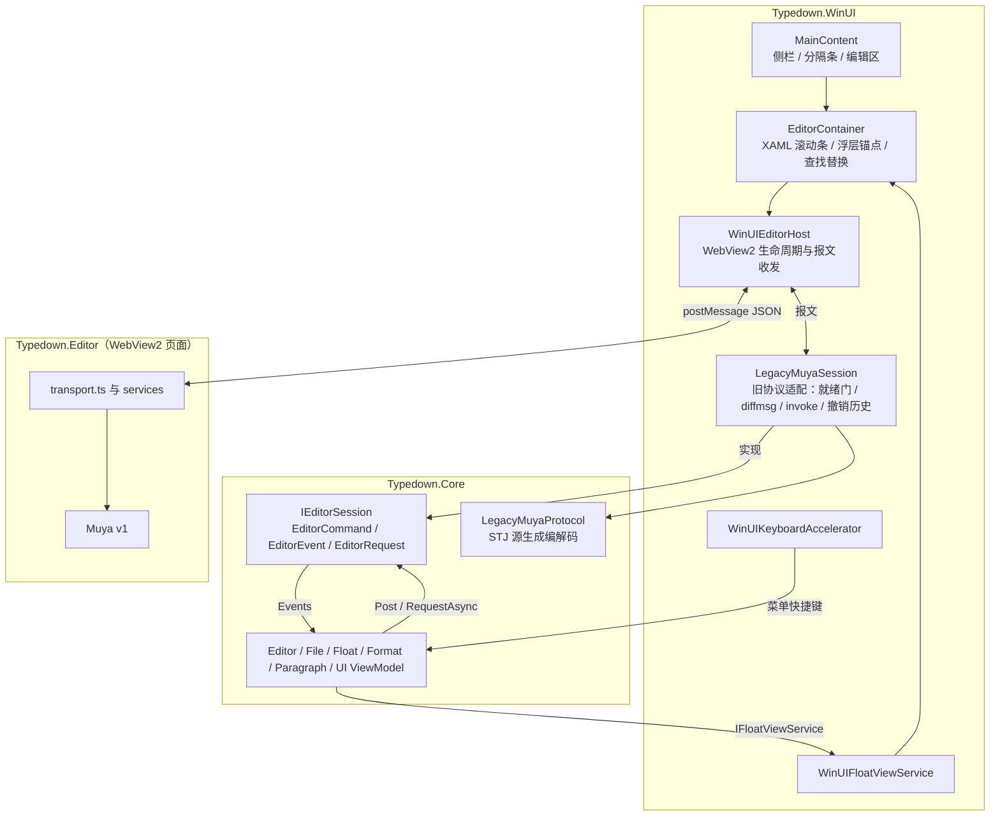
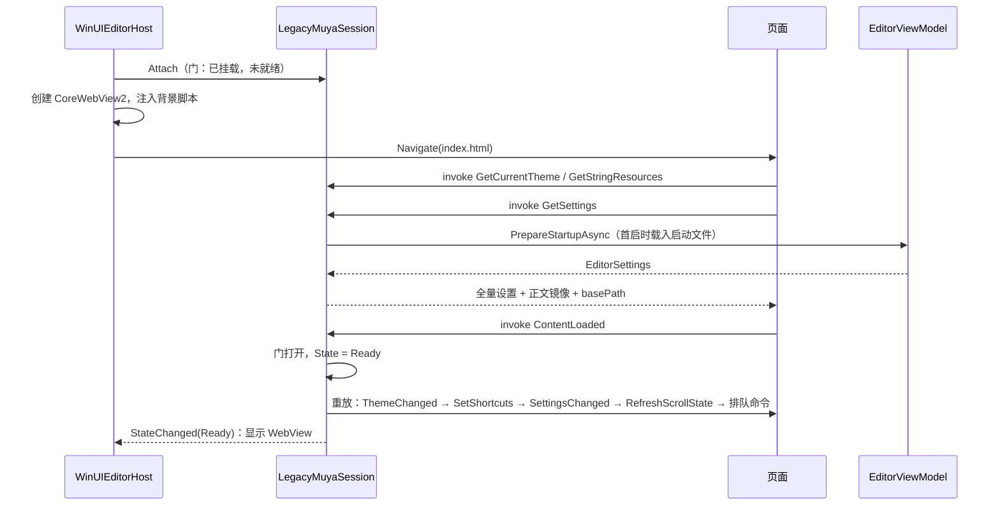
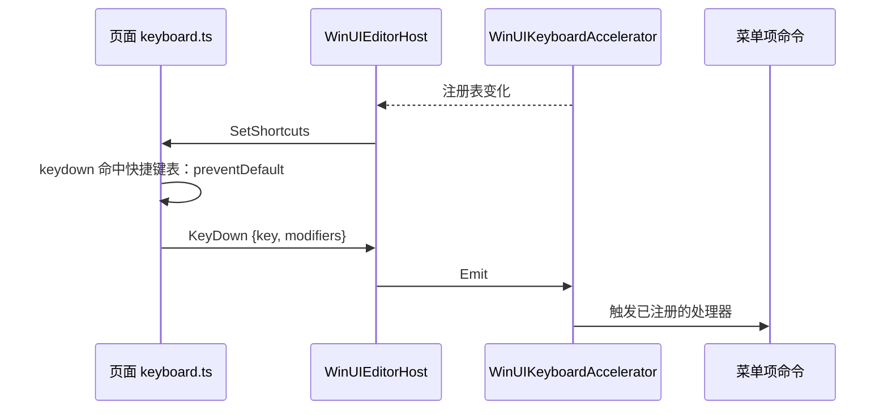
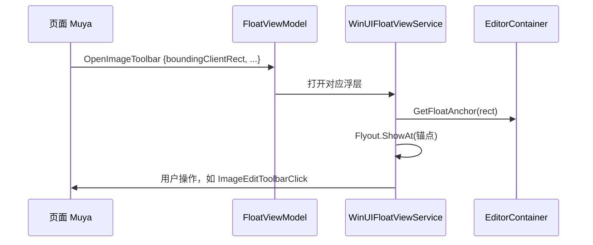
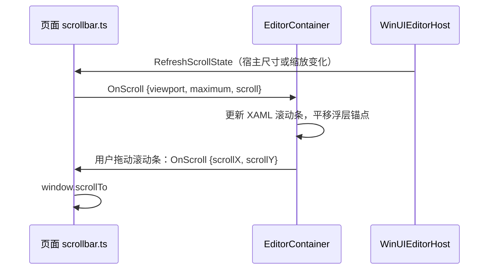
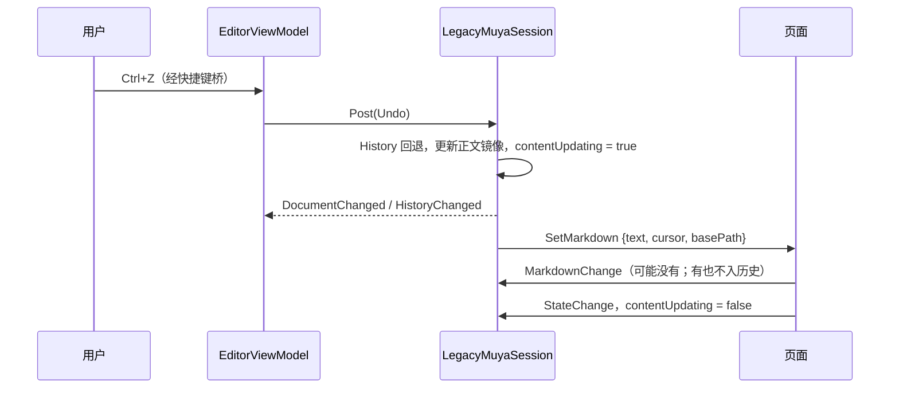

# Typedown 当前架构

## 概念

| 术语 | 含义 |
|---|---|
| 宿主 | WinUI3 应用本体 [Typedown.WinUI](../Dev/Typedown.WinUI/)，负责窗口、菜单、文件、设置和所有 XAML 浮层 |
| 页面 | 运行在 WebView2 里的编辑器前端 [Typedown.Editor](../Dev/Typedown.Editor/)：React 外壳 + 1.2.19 的 in-tree Muya v1，负责正文的渲染与编辑 |
| 编辑会话 | Core 里的强类型契约 [IEditorSession](../Dev/Typedown.Core/Editor/IEditorSession.cs)：ViewModel 只通过它投递命令（`EditorCommand`）、订阅事件（`EditorEvent`）、发起请求（`EditorRequest<T>`），不接触消息名与 JSON |
| 桥 | 宿主与页面之间的 JSON 消息通道，页面侧是 [transport.ts](../Dev/Typedown.Editor/src/services/transport.ts)，宿主侧是编辑会话的旧协议适配器 [LegacyMuyaSession](../Dev/Typedown.WinUI/Controls/EditorControls/Hosting/LegacyMuyaSession.cs) |
| invoke | 页面发起、宿主应答的 RPC，带 `id`，宿主回 `{code, data}` |
| message | 单向事件，两个方向都有 |
| diffmsg | 页面→宿主的增量事件，只发送与上一次载荷的差异段，两端各存一份前值 |
| 宿主浮层 | 页面只上报位置，由宿主用 XAML Flyout 画出的浮动 UI（格式选择、表格工具、图片工具栏等） |
| 快捷键表 | 宿主当前注册的全部快捷键和弦，下发给页面用于在页面内拦截 |

## 架构

每个窗口独占一个进程。进程内由 Core 的 ViewModel 持有应用状态，经强类型的编辑会话 `IEditorSession` 驱动编辑器；WinUI 侧的 `LegacyMuyaSession` 实现这个会话，把命令、事件、请求翻译成旧 Muya 页面的 JSON 报文，`WinUIEditorHost` 只负责把报文送进送出 WebView2。

## 分点解释

### 1. 工程与分层

| 工程 | 职责 |
|---|---|
| [Typedown.Core](../Dev/Typedown.Core/) | 模型、配置、持久化、编辑会话契约（[Editor](../Dev/Typedown.Core/Editor/)）、旧页面协议的无状态编解码（[Editor/Legacy](../Dev/Typedown.Core/Editor/Legacy/)）与新引擎线协议的编解码和正文镜像（[Editor/Wire](../Dev/Typedown.Core/Editor/Wire/)，见 [editor-protocol.md](editor-protocol.md)）、ViewModel 与平台抽象接口（`IFloatViewService`、`IKeyboardAccelerator` 等）；AnyCPU、`IsAotCompatible`，全部 JSON 走 System.Text.Json 源生成，不引用 Newtonsoft、WinUI / Windows SDK 投影，不含任何 UI 类型 |
| [Typedown.WinUI](../Dev/Typedown.WinUI/) | 入口、窗口、XAML 控件与页面，实现 Core 的平台接口 |
| [Typedown.Editor](../Dev/Typedown.Editor/) | 页面前端（CRA + react-app-rewired，Yarn 1），宿主从本地文件加载它的构建产物 |
| [Tests](../Tests/) | `ArchitectureTests` 守护分层，`CoreTests` 覆盖 Core |

依赖方向由 [LayerDependencyGuardTests](../Tests/Typedown.ArchitectureTests/Guards/LayerDependencyGuardTests.cs) 与 [CleanArchitectureGuardTests](../Tests/Typedown.ArchitectureTests/Guards/CleanArchitectureGuardTests.cs) 强制，会话契约的形状（六个成员、命令事件无 `object` / `JsonElement` 字段、ViewModel 不碰 Newtonsoft）由 [EditorContractGuardTests](../Tests/Typedown.ArchitectureTests/Guards/EditorContractGuardTests.cs) 守住：Core 不引用 WinUI 与 Editor，也不得引用 `Microsoft.UI.*` / `Microsoft.WinUI`、Windows SDK 投影（`Microsoft.Windows.SDK.NET`、`WinRT.Runtime`、`Windows.*`）、`Microsoft.Web.WebView2` 与 `SkiaSharp`。工程只分两层，唯一的边界是「有没有平台 UI 类型」：ViewModel 不碰平台类型、可脱离 WinUI 测试，所以与模型和桥协议同在 Core。

### 2. 进程、窗口与 DI 作用域

[Program.cs](../Dev/Typedown.WinUI/Program.cs) 用 `AppInstance` 做单实例：普通激活（如双击 .md）会重定向给主实例；「新窗口」由 [App.xaml.cs](../Dev/Typedown.WinUI/App.xaml.cs) 带 `--typedown-new-window` 参数另起一个进程，所以窗口与进程一一对应。进程内只创建一个 `uiScope`，所有 Scoped 注册（ViewModel、`LegacyMuyaSession` 及其 `IEditorSession` 别名、`IKeyboardAccelerator` 等）实际上都是进程级单例，按 Scoped 注册只是表达「属于窗口」的语义。

页面的 invoke 由会话自己应答；需要应用状态的几项（启动设置与正文、表格尺寸对话框、写剪贴板、`BasePath`）经 [IEditorHostCallbacks](../Dev/Typedown.Core/Editor/IEditorHostCallbacks.cs) 回问 `EditorViewModel`，所以不存在「处理器必须先于第一条报文注册」的时序要求。ViewModel 在构造时订阅 `Session.Events`，`WinUIEditorHost` 构造时仍先解析各 ViewModel，保证订阅在第一条事件前就位。

### 3. 编辑器宿主

[WinUIEditorHost](../Dev/Typedown.WinUI/Controls/EditorControls/Hosting/WinUIEditorHost.cs) 只负责 WebView2 生命周期、报文收发、主题与输入，不持有正文、不做文件 IO、不认识消息名：收到的报文原样交给 `LegacyMuyaSession.ReceiveAsync`，会话要发的报文经内部接口 `ILegacyMuyaChannel.TryPost` 投给 CoreWebView2。宿主 `Loaded` 时 `Attach`、`Unloaded` 时 `Detach`，导航开始与渲染进程退出也通知会话。WebView2 环境由 [WinUIWebViewEnvironmentService](../Dev/Typedown.WinUI/Services/WinUIWebViewEnvironmentService.cs) 创建，启动参数取自 [Config.cs](../Dev/Typedown.Core/Config.cs) 的 `WebView2Args`，用户数据目录是应用本地数据目录下的 `WebView2`。页面从输出目录的 `Resources/Statics/index.html` 加载；`ContentLoaded` 之前 WebView 保持透明，并由注入脚本先刷好背景色，避免白闪。

初始正文由页面在 `GetSettings` 里主动拉取；应答在途时 `LoadDocument` 只更新正文镜像、不另发 `LoadFile`，因此不存在初始文档竞态。就绪门 [EditorCommandGate](../Dev/Typedown.Core/Editor/EditorCommandGate.cs) 在「已挂载且页面已 ContentLoaded」时才放行：门关期间普通命令按序排队（上限 128，满了丢最旧），主题、快捷键表、视口刷新只留最新一份，设置增量合并成一份；重新导航时排队的命令作废，页面经启动握手拿回全量状态。宿主卸载期间（例如打开设置页）门也照样保留，回到编辑器时重放，所以设置页里改的编辑器设置不会丢。invoke 应答不经过门。页面未捕获的异常经 invoke `UnhandledException` 上报，会话重载页面自愈，同一异常只上报一次。渲染进程退出（`RenderProcessExited`）时宿主重载页面，[EditorCrashRecovery](../Dev/Typedown.Core/Editor/EditorCrashRecovery.cs) 决定是否重载与是否恢复光标：一分钟内崩溃超过 3 次停止自动重载，距上次崩溃不足 15 秒不恢复光标；恢复光标时会话在启动应答之前先发一条 `SetMarkdown`。主题由 [EditorThemeFactory](../Dev/Typedown.WinUI/Controls/EditorControls/Hosting/EditorThemeFactory.cs) 按 `ElementTheme` 统一生成（明暗、系统强调色、实色背景），`GetCurrentTheme` 应答与 `ThemeChanged` 同源，编辑区不透 Mica。

### 4. 桥接协议

本节描述现有 Muya 页面的旧协议；新引擎页面的协议见 [editor-protocol.md](editor-protocol.md)。页面→宿主只有三种报文：`{type:"invoke", id, name, args}`、`{type:"message", name, args}`、`{type:"diffmsg", name, diff, args, start, end}`。宿主→页面统一是 `{name, args}`，invoke 的应答也是这个形状，`name` 取请求的 `id`。编解码集中在 [LegacyMuyaProtocol](../Dev/Typedown.Core/Editor/Legacy/LegacyMuyaProtocol.cs)：载荷是 [LegacyMuyaWire](../Dev/Typedown.Core/Editor/Legacy/LegacyMuyaWire.cs) 里的内部 record，经 System.Text.Json 源生成序列化（camelCase 字段名与字典键，`UnsafeRelaxedJsonEscaping` 让中文与 HTML 原样输出），外层信封用 `Utf8JsonWriter` 手写。页面只用 `JSON.parse` 读，所以约定的是字段名与值类型，不约定字节形态；[LegacyMuyaEncodingTests](../Tests/Typedown.CoreTests/Editor/LegacyMuyaEncodingTests.cs) 按「解析后逐字段相等」校验每条命令的线上形状，并用反射保证每个 `EditorCommand` 都有译法。页面的字符串词汇（格式名、段落名、表格操作、提示资源键等）在 [LegacyMuyaVocabulary](../Dev/Typedown.Core/Editor/Legacy/LegacyMuyaVocabulary.cs) 与契约里的枚举互译，认不出的页面值直接丢弃。

页面事件除 `KeyDown` 外都走 diffmsg：只传与上一次载荷字符串的差异段，页面 `prevMap` 与宿主 [LegacyDiffChannel](../Dev/Typedown.Core/Editor/Legacy/LegacyDiffChannel.cs) 各存前值。差异是对页面自己的 `JSON.stringify` 结果算的，与宿主的序列化无关。通道能自愈：宿主先更新前值再分发，订阅者抛异常不会失步；页面重载后第一条是 `diff:false` 的全量，会覆盖宿主前值。

正文的唯一来源是页面。会话通过 `MarkdownChange` 维护正文镜像 `Session.Document`，据此发出 `DocumentChanged`、维护撤销历史；`EditorViewModel` 在此之上算字数与脏标记，文件路径与保存状态归 `FileViewModel`。设置变更由 `EditorViewModel` 监听 `SettingsViewModel` 后投递 `ApplySettings`，会话以 `SettingsChanged` 推给页面。

### 5. 消息清单

页面→宿主 invoke（全部由 `LegacyMuyaSession` 应答）：

| 名称 | 会话的处理 |
|---|---|
| `GetSettings` | 回问 `IEditorHostCallbacks.PrepareStartupAsync`，应答全量设置、正文镜像与 `BasePath` |
| `GetStringResources` | 按页面给的资源键取本地化字符串 |
| `GetCurrentTheme` / `ContentLoaded` | 取宿主当前主题；打开就绪门 |
| `ResizeTable` | 回问 `PickTableSizeAsync`（表格尺寸对话框） |
| `SetClipboard` | 把相邻的 text/html 与 text/plain 合并成一次多格式写入，经 `WriteClipboardAsync` 写剪贴板 |
| `ExportCallback` / `PrintHTML` | 按 `context.requestId` 完成对应的 `RenderExportHtml` 请求 |
| `OpenNewWindow` / `UnhandledException` | 发 `LinkOpenRequested`；重载页面并上报异常 |

页面→宿主事件与契约事件：

| 页面消息 | 契约事件 | 订阅者 |
|---|---|---|
| `MarkdownChange` / `FileLoaded` | `DocumentChanged` / `DocumentLoaded`，只带版本号（先更新正文镜像与撤销历史，镜像版本加一；订阅者读 `Session.Document.Text`） | EditorViewModel（`DocumentLoaded` 另有 FileViewModel 与宿主订阅） |
| `CursorChange` | 无，只喂撤销历史与崩溃恢复 | 会话自身 |
| `StateChange` | `StatsChanged` + `OutlineChanged`（标题 id 包成 `HeadingId`） | EditorViewModel |
| `SelectionChange` / `CodeMirrorSelectionChange` | `SelectionChanged`（Muya 另带块上下文与选中图片） | EditorViewModel |
| `SelectionFormats` | `MarksChanged` | FormatViewModel |
| `OpenFrontMenu` / `OpenFormatPicker` / `OpenImageSelector` / `OpenImageToolbar` / `OpenTableTools` / `OpenToolTip` | `BlockMenuRequested` / `FormatPickerRequested` / `ImageEditorRequested` / `ImageToolbarRequested` / `TableToolsRequested` / `TooltipRequested`（`TooltipKind`）或 `TooltipDismissed` | FloatViewModel |
| `OnScroll` | `ViewportChanged` | EditorContainer |
| `OpenURI` / `KeyDown` | `LinkOpenRequested` / `ShortcutPressed` | EditorViewModel / WinUIEditorHost |

契约命令与页面消息：

| 契约命令 | 页面消息 | 投递者 |
|---|---|---|
| `LoadDocument` / `ImportHtml`，请求 `RenderExportHtml` | `LoadFile` / `ImportFile` / `Export` | FileViewModel |
| 请求 `FlushDocument` / `ContextAt` | 无页面消息：会话直接应答镜像版本（页面每次变化都已上报）/ 最后一次 `SelectionChanged` 的 `Rich` | FileViewModel / 右键菜单（新引擎接入后） |
| `Undo` / `Redo` / `ClearUndoHistory` | 会话侧撤销历史，再以 `SetMarkdown` 回灌 | EditorViewModel |
| `Copy` / `Cut` / `Paste` / `SelectAll` / `DeleteSelection` / `Search` / `FindMatch` / `RevealHeading` / `InsertImage` | `Copy` / `Cut` / `Paste` / `SelectAll` / `DeleteSelection` / `Search` / `Find` / `ScrollTo` / `InsertImage` | EditorViewModel |
| `ToggleInlineMark` / `ClearInlineMarks` | `Format` | FormatViewModel |
| `SetBlockKind` / `PromoteHeading` / `DemoteHeading` / `InsertParagraph` / `DeleteParagraph` / `DuplicateParagraph` / `InsertTable` | `UpdateParagraph` / `InsertParagraph` / `DeleteParagraph` / `Duplicate` / `InsertTable` | ParagraphViewModel |
| `EndSearch` | `SearchOpenChange` | FloatViewModel |
| `Replace` / `ReplaceImage` / `ApplyImageToolbarAction` / `SetImageZoom` / `EditTable` / `BlockMenuClosed` / `ScrollTo` | `Replace` / `ReplaceImage` / `ImageEditToolbarClick` / `EditTable` / `FrontMenuClosed` / `OnScroll` | 宿主浮层与 EditorContainer |
| `ApplySettings` | `SettingsChanged`（只带变化的项） | EditorViewModel |
| `ApplyTheme` | `ThemeChanged` | App |
| `SetKeymap` / `RefreshViewport` | `SetShortcuts` / `RefreshScrollState` | WinUIEditorHost |

两侧已完全对齐：每条宿主命令页面都有监听，页面发出的每个事件会话都有译法。页面 [common.ts](../Dev/Typedown.Editor/src/services/remote/common.ts) 声明了从未被调用的 invoke `LoadImage`，会话对它和其他未知 invoke 一律应答 `function [X] does not exist`；页面已不再发出的 `Save`、`SaveAs`、`Close`、`OpenFindReplace`、`OpenContextMenu` 不再有宿主订阅。

### 6. 快捷键与右键菜单

WinUI3 的 WebView2 独占键盘与指针输入，焦点在编辑器里时 XAML 收不到 `KeyDown`，也看不到右键。快捷键全部由菜单项经 `IKeyboardAccelerator.Register` 注册（用户可在设置里改）。[WinUIKeyboardAccelerator](../Dev/Typedown.WinUI/Services/WinUIKeyboardAccelerator.cs) 维护一张带引用计数的和弦表，表一变化宿主就发 `SetShortcuts`；页面的 [keyboard.ts](../Dev/Typedown.Editor/src/services/keyboard.ts) 在捕获阶段比对，命中就拦下并回传 `KeyDown`。输入法组字、已被处理的事件、单按修饰键一律放行；长按重复不过滤，保证 Ctrl+Z 这类宿主和弦一次都不会漏给浏览器的原生撤销。

右键走原生路径：`AreDefaultContextMenusEnabled` 保持开启，`CoreWebView2.ContextMenuRequested` 触发后宿主置 `Handled = true` 抑制浏览器菜单，再由 [EditorContainer](../Dev/Typedown.WinUI/Controls/EditorControls/EditorContainer.xaml.cs) 在同一位置弹出 XAML `MenuFlyout`。页面侧（`App.tsx` 与 Muya 的 `clickEvent.js`）都不能 `preventDefault` contextmenu，否则这个事件不会触发。Ctrl+滚轮调整的是设置里的字号，不是 WebView 缩放。

### 7. 宿主浮层与坐标

Muya 需要浮动 UI 时只发 `OpenXxx` 事件，载荷里带目标的 `boundingClientRect`。`FloatViewModel` 交给 [WinUIFloatViewService](../Dev/Typedown.WinUI/Services/WinUIFloatViewService.cs)，后者用 `EditorContainer.GetFloatAnchor` 把一个不可见锚点摆到该矩形上，再把 Flyout 挂在锚点上；用户操作以命令回传页面，页面滚动时锚点跟着平移。

宿主在浮层锚点、锚点平移和右键坐标三处直接把页面的 CSS px 当作 XAML 的 DIP 用。这依赖 WebView2 在 `ZoomFactor = 1` 时 CSS px = DIP 的约定，宿主从不修改 `ZoomFactor`。

### 8. 滚动条与编辑区宽度

页面原生滚动条被隐藏，横竖两条滚动条都是 `EditorContainer` 里的 XAML `ScrollBar`。页面 [scrollbar.ts](../Dev/Typedown.Editor/src/services/scrollbar.ts) 在尺寸、滚动或宿主请求时，于下一帧上报 `OnScroll`（视口尺寸、可滚动量、当前位置）；拖动 XAML 滚动条时，宿主以 `OnScroll` 命令让页面 `scrollTo`。

分数缩放（如 175%）下 CSS 视口宽度是小数，`innerWidth` 与 `scrollWidth` 各自取整后会差出 1px，所以不超过 1px 的溢出按 0 处理。WebView2 在 XAML 布局之后才异步更新内核视口，因此宿主尺寸变化或 `XamlRoot` 缩放变化（跨显示器）时，宿主会发 `RefreshScrollState` 请页面补报。Muya 正文区与 `body` 都有 `min-width: 400px`，视口再窄只能横向溢出；[MainContent](../Dev/Typedown.WinUI/Controls/EditorControls/MainContent.xaml.cs) 给编辑区列设动态下限 `min(400, 可用宽度)`，让分隔条压不窄编辑区（`GridSplitter` 会校验相邻列的 `MinWidth`），窗口本身太窄时则不硬撑，免得 Grid 裁掉编辑区和竖向滚动条。

### 9. 文档状态与撤销

[FileViewModel](../Dev/Typedown.Core/ViewModels/FileViewModel.cs) 打开、新建文档时同步调用 `ApplyDocument` 写入路径、正文与哈希，并投递 `LoadDocument(text, basePath)`：会话据此重置正文镜像与撤销历史基线，再发 `LoadFile`（启动握手在途时不发，见第 3 节）。读文件经 [TextFileCodec](../Dev/Typedown.Core/Services/TextFileCodec.cs)：按 BOM 认编码，记下编码、BOM 与原换行符（混合时取多数者），交给编辑器的正文统一成 `\n`，保存与另存为时按记下的格式还原，所以打开后不编辑直接保存，文件字节不变；新建文档是 UTF-8 无 BOM、`\n`。`EditorViewModel.Saved` 由 `FileHash` 与当前正文哈希比较得出。手动保存、另存为、导出、打印与 `AskToSave`（关闭窗口、打开别的文件之前）先 `await RequestAsync(new FlushDocument())` 再取正文镜像的快照写盘，写盘后镜像仍是这份快照（版本相同或正文相同）才标记已保存；自动保存与备份直接读镜像。自动保存的计时器在线程池上触发，回调先切回 UI 线程再读正文与文件状态。

撤销历史由会话里的 [ContentHistory](../Dev/Typedown.Core/Models/RuntimeModels/ContentHistory.cs) 维护，页面没有自己的撤销栈。它是整篇快照：正文变化先落在待提交快照里，3 秒无新变化、光标换行或发起撤销时提交成一步，最多 100 步；`Undoable` / `Redoable` 变化以 `HistoryChanged` 事件在 UI 线程发出。撤销/重做时，会话取出历史正文、更新正文镜像并发 `DocumentChanged`，置 `contentUpdating` 后以 `SetMarkdown {text, cursor, basePath}` 推给页面；页面若回显 `MarkdownChange`，因 `contentUpdating` 不会再次入栈，下一次 `StateChange` 或 `CodeMirrorSelectionChange` 到来时复位。

