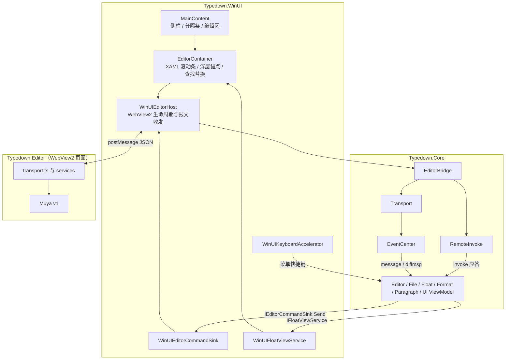
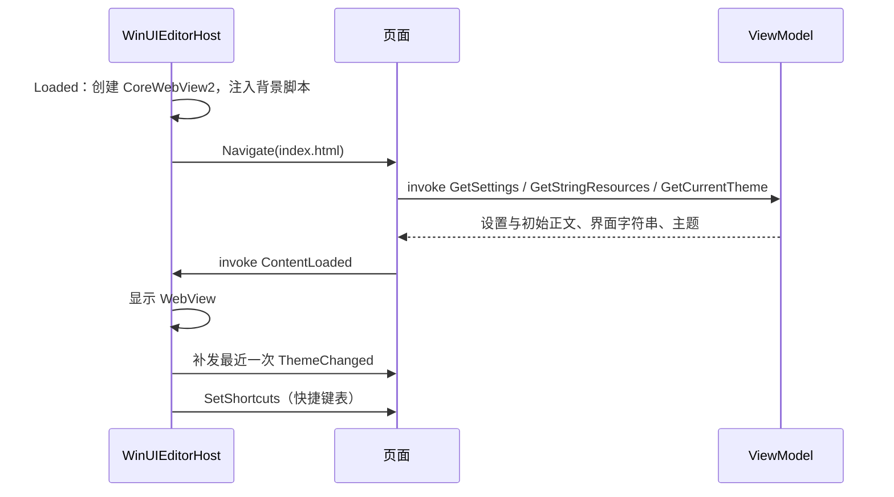
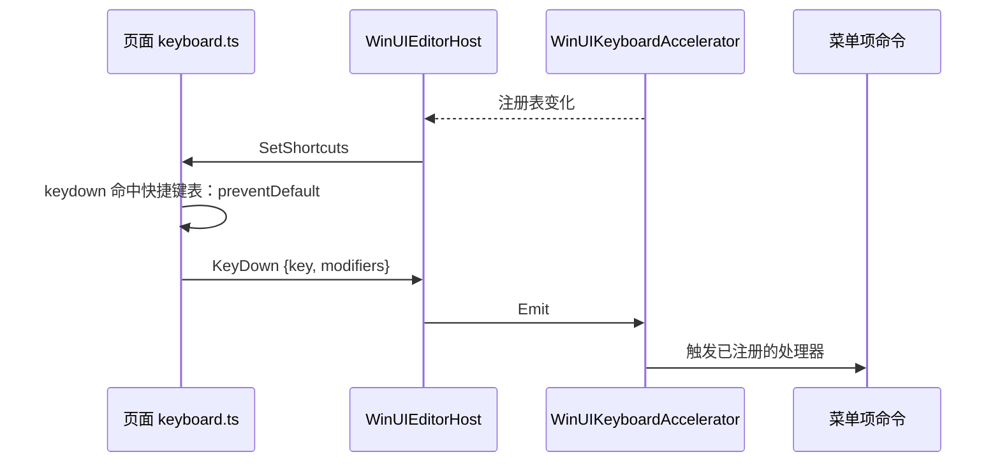
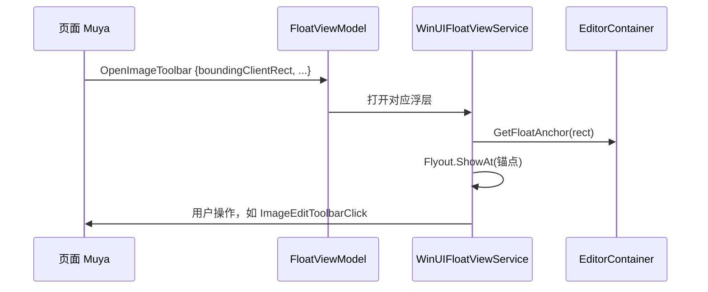
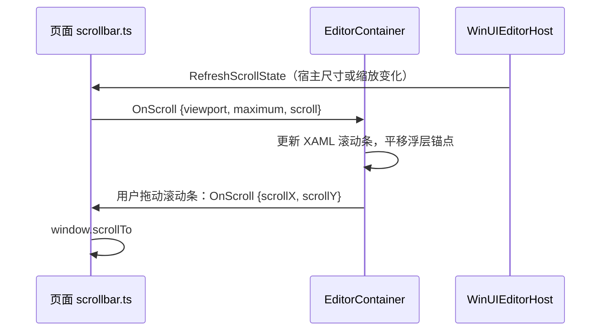
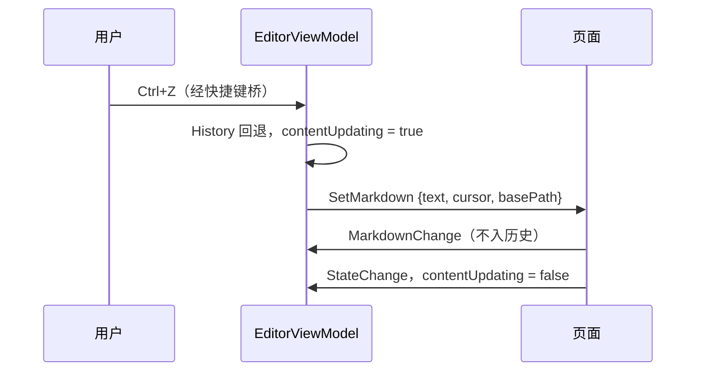

# Typedown 当前架构

## 概念

| 术语 | 含义 |
|---|---|
| 宿主 | WinUI3 应用本体 [Typedown.WinUI](../Dev/Typedown.WinUI/)，负责窗口、菜单、文件、设置和所有 XAML 浮层 |
| 页面 | 运行在 WebView2 里的编辑器前端 [Typedown.Editor](../Dev/Typedown.Editor/)：React 外壳 + 1.2.19 的 in-tree Muya v1，负责正文的渲染与编辑 |
| 桥 | 宿主与页面之间的 JSON 消息通道，页面侧是 [transport.ts](../Dev/Typedown.Editor/src/services/transport.ts)，宿主侧是 [EditorBridge](../Dev/Typedown.Core/Services/EditorBridge.cs) |
| invoke | 页面发起、宿主应答的 RPC，带 `id`，宿主回 `{code, data}` |
| message | 单向事件，两个方向都有 |
| diffmsg | 页面→宿主的增量事件，只发送与上一次载荷的差异段，两端各存一份前值 |
| 宿主浮层 | 页面只上报位置，由宿主用 XAML Flyout 画出的浮动 UI（格式选择、表格工具、图片工具栏等） |
| 快捷键表 | 宿主当前注册的全部快捷键和弦，下发给页面用于在页面内拦截 |

## 架构

每个窗口独占一个进程。进程内由 Core 的 ViewModel 持有应用状态，经 Core 的桥与页面通信；WinUI 负责把桥接到 WebView2，并把 ViewModel 的意图画成 XAML。

## 分点解释

### 1. 工程与分层

| 工程 | 职责 |
|---|---|
| [Typedown.Core](../Dev/Typedown.Core/) | 模型、配置、持久化、桥协议（`EditorBridge` / `RemoteInvoke` / `Transport` / `EventCenter`）、ViewModel 与平台抽象接口（`IEditorCommandSink`、`IFloatViewService`、`IKeyboardAccelerator` 等）；AnyCPU、`IsAotCompatible`，不引用 WinUI / Windows SDK 投影，不含任何 UI 类型 |
| [Typedown.WinUI](../Dev/Typedown.WinUI/) | 入口、窗口、XAML 控件与页面，实现 Core 的平台接口 |
| [Typedown.Editor](../Dev/Typedown.Editor/) | 页面前端（CRA + react-app-rewired，Yarn 1），宿主从本地文件加载它的构建产物 |
| [Tests](../Tests/) | `ArchitectureTests` 守护分层，`CoreTests` 覆盖 Core |

依赖方向由 [LayerDependencyGuardTests](../Tests/Typedown.ArchitectureTests/Guards/LayerDependencyGuardTests.cs) 与 [CleanArchitectureGuardTests](../Tests/Typedown.ArchitectureTests/Guards/CleanArchitectureGuardTests.cs) 强制：Core 不引用 WinUI 与 Editor，也不得引用 `Microsoft.UI.*` / `Microsoft.WinUI`、Windows SDK 投影（`Microsoft.Windows.SDK.NET`、`WinRT.Runtime`、`Windows.*`）、`Microsoft.Web.WebView2` 与 `SkiaSharp`。工程只分两层，唯一的边界是「有没有平台 UI 类型」：ViewModel 不碰平台类型、可脱离 WinUI 测试，所以与模型和桥协议同在 Core。

### 2. 进程、窗口与 DI 作用域

[Program.cs](../Dev/Typedown.WinUI/Program.cs) 用 `AppInstance` 做单实例：普通激活（如双击 .md）会重定向给主实例；「新窗口」由 [App.xaml.cs](../Dev/Typedown.WinUI/App.xaml.cs) 带 `--typedown-new-window` 参数另起一个进程，所以窗口与进程一一对应。进程内只创建一个 `uiScope`，所有 Scoped 注册（ViewModel、`RemoteInvoke`、`Transport`、`IEditorCommandSink`、`IKeyboardAccelerator` 等）实际上都是进程级单例，按 Scoped 注册只是表达「属于窗口」的语义。

ViewModel 是惰性解析的，却在构造函数里注册桥接处理器；页面一加载就会 invoke `GetSettings` 等，所以 `WinUIEditorHost` 构造时会先把各 ViewModel 实例化一遍，保证处理器在第一条报文到达前就位。

### 3. 编辑器宿主

[WinUIEditorHost](../Dev/Typedown.WinUI/Controls/EditorControls/Hosting/WinUIEditorHost.cs) 只负责 WebView2 生命周期、报文收发、主题与输入，不持有正文、不做文件 IO、不过滤消息名，协议解析全部交给 `EditorBridge`。WebView2 环境由 [WinUIWebViewEnvironmentService](../Dev/Typedown.WinUI/Services/WinUIWebViewEnvironmentService.cs) 创建，启动参数取自 [Config.cs](../Dev/Typedown.Core/Config.cs) 的 `WebView2Args`，用户数据目录是应用本地数据目录下的 `WebView2`。页面从输出目录的 `Resources/Statics/index.html` 加载；`ContentLoaded` 之前 WebView 保持透明，并由注入脚本先刷好背景色，避免白闪。

初始正文由页面在 `GetSettings` 里主动拉取，启动时宿主载入文件不再推送 `LoadFile`，因此不存在初始文档竞态。`CoreWebView2` 就绪前，宿主→页面的报文由 [PendingRawMessageQueue](../Dev/Typedown.WinUI/Controls/EditorControls/Hosting/PendingRawMessageQueue.cs) 按序缓存。页面未捕获的异常经 invoke `UnhandledException` 上报，宿主重载页面自愈，同一异常只上报一次。主题载荷是 [EditorThemePayload](../Dev/Typedown.WinUI/Controls/EditorControls/Hosting/EditorThemePayload.cs)（明暗、强调色、实色背景），编辑区不透 Mica。

### 4. 桥接协议

页面→宿主只有三种报文：`{type:"invoke", id, name, args}`、`{type:"message", name, args}`、`{type:"diffmsg", name, diff, args, start, end}`。宿主→页面统一是 `{name, args}`，invoke 的应答也是这个形状，`name` 取请求的 `id`。宿主侧用 Newtonsoft 按 `Config.EditorJsonSerializerSettings`（camelCase）序列化。

页面事件除 `KeyDown` 外都走 diffmsg：只传与上一次载荷字符串的差异段，页面 `prevMap` 与宿主 `Transport.prevDic` 各存前值。通道能自愈：宿主先更新前值再分发，订阅者抛异常不会失步；页面重载后第一条是 `diff:false` 的全量，会覆盖宿主前值。

正文的唯一来源是 Muya。`EditorViewModel` 通过 `MarkdownChange` 镜像正文，并据此维护字数、脏标记与撤销历史；文件路径与保存状态归 `FileViewModel`。设置变更由 `WinUIEditorSettingsNotifier` 以 `SettingsChanged` 推给页面。

### 5. 消息清单

页面→宿主 invoke：

| 名称 | 处理者 |
|---|---|
| `GetSettings` / `SetClipboard` | EditorViewModel |
| `GetStringResources` | UIViewModel |
| `ResizeTable` | ParagraphViewModel |
| `ExportCallback` / `PrintHTML` | FileViewModel |
| `ContentLoaded` / `GetCurrentTheme` / `UnhandledException` / `OpenNewWindow` | WinUIEditorHost |

页面→宿主事件：

| 名称 | 订阅者 |
|---|---|
| `MarkdownChange` / `StateChange` / `CursorChange` / `SelectionChange` / `CodeMirrorSelectionChange` / `FileLoaded` | EditorViewModel（`FileLoaded` 另有 FileViewModel 与宿主订阅） |
| `SelectionFormats` | FormatViewModel |
| `OpenFrontMenu` / `OpenFormatPicker` / `OpenImageSelector` / `OpenImageToolbar` / `OpenTableTools` / `OpenToolTip` | FloatViewModel |
| `OnScroll` | EditorContainer |
| `OpenURI` / `KeyDown` | WinUIEditorHost |

宿主→页面命令：

| 名称 | 发出者 |
|---|---|
| `LoadFile` / `ImportFile` / `Export` | FileViewModel |
| `SetMarkdown` / `Copy` / `Cut` / `Paste` / `SelectAll` / `DeleteSelection` / `Search` / `Find` / `ScrollTo` / `InsertImage` | EditorViewModel |
| `Format` | FormatViewModel |
| `UpdateParagraph` / `InsertParagraph` / `DeleteParagraph` / `Duplicate` / `InsertTable` | ParagraphViewModel |
| `SearchOpenChange` | FloatViewModel |
| `Replace` / `ReplaceImage` / `ImageEditToolbarClick` / `EditTable` / `FrontMenuClosed` / `OnScroll` | 宿主浮层与 EditorContainer |
| `SettingsChanged` | WinUIEditorSettingsNotifier |
| `ThemeChanged` | App |
| `SetShortcuts` / `RefreshScrollState` | WinUIEditorHost |

两侧已完全对齐：每条宿主命令页面都有监听，每个页面事件宿主都有订阅。仅剩两类无害残留：页面 [common.ts](../Dev/Typedown.Editor/src/services/remote/common.ts) 声明了从未被调用的 invoke `LoadImage`（宿主无处理器）；宿主仍订阅着页面已不再发出的 `Save`、`SaveAs`、`Close`、`OpenFindReplace`、`OpenContextMenu`。

### 6. 快捷键与右键菜单

WinUI3 的 WebView2 独占键盘与指针输入，焦点在编辑器里时 XAML 收不到 `KeyDown`，也看不到右键。快捷键全部由菜单项经 `IKeyboardAccelerator.Register` 注册（用户可在设置里改）。[WinUIKeyboardAccelerator](../Dev/Typedown.WinUI/Services/WinUIKeyboardAccelerator.cs) 维护一张带引用计数的和弦表，表一变化宿主就发 `SetShortcuts`；页面的 [keyboard.ts](../Dev/Typedown.Editor/src/services/keyboard.ts) 在捕获阶段比对，命中就拦下并回传 `KeyDown`。输入法组字、已被处理的事件、单按修饰键一律放行；长按重复不过滤，保证 Ctrl+Z 这类宿主和弦一次都不会漏给浏览器的原生撤销。

右键走原生路径：`AreDefaultContextMenusEnabled` 保持开启，`CoreWebView2.ContextMenuRequested` 触发后宿主置 `Handled = true` 抑制浏览器菜单，再由 [EditorContainer](../Dev/Typedown.WinUI/Controls/EditorControls/EditorContainer.xaml.cs) 在同一位置弹出 XAML `MenuFlyout`。页面侧（`App.tsx` 与 Muya 的 `clickEvent.js`）都不能 `preventDefault` contextmenu，否则这个事件不会触发。Ctrl+滚轮调整的是设置里的字号，不是 WebView 缩放。

### 7. 宿主浮层与坐标

Muya 需要浮动 UI 时只发 `OpenXxx` 事件，载荷里带目标的 `boundingClientRect`。`FloatViewModel` 交给 [WinUIFloatViewService](../Dev/Typedown.WinUI/Services/WinUIFloatViewService.cs)，后者用 `EditorContainer.GetFloatAnchor` 把一个不可见锚点摆到该矩形上，再把 Flyout 挂在锚点上；用户操作以命令回传页面，页面滚动时锚点跟着平移。

宿主在浮层锚点、锚点平移和右键坐标三处直接把页面的 CSS px 当作 XAML 的 DIP 用。这依赖 WebView2 在 `ZoomFactor = 1` 时 CSS px = DIP 的约定，宿主从不修改 `ZoomFactor`。

### 8. 滚动条与编辑区宽度

页面原生滚动条被隐藏，横竖两条滚动条都是 `EditorContainer` 里的 XAML `ScrollBar`。页面 [scrollbar.ts](../Dev/Typedown.Editor/src/services/scrollbar.ts) 在尺寸、滚动或宿主请求时，于下一帧上报 `OnScroll`（视口尺寸、可滚动量、当前位置）；拖动 XAML 滚动条时，宿主以 `OnScroll` 命令让页面 `scrollTo`。

分数缩放（如 175%）下 CSS 视口宽度是小数，`innerWidth` 与 `scrollWidth` 各自取整后会差出 1px，所以不超过 1px 的溢出按 0 处理。WebView2 在 XAML 布局之后才异步更新内核视口，因此宿主尺寸变化或 `XamlRoot` 缩放变化（跨显示器）时，宿主会发 `RefreshScrollState` 请页面补报。Muya 正文区与 `body` 都有 `min-width: 400px`，视口再窄只能横向溢出；[MainContent](../Dev/Typedown.WinUI/Controls/EditorControls/MainContent.xaml.cs) 给编辑区列设动态下限 `min(400, 可用宽度)`，让分隔条压不窄编辑区（`GridSplitter` 会校验相邻列的 `MinWidth`），窗口本身太窄时则不硬撑，免得 Grid 裁掉编辑区和竖向滚动条。

### 9. 文档状态与撤销

[FileViewModel](../Dev/Typedown.Core/ViewModels/FileViewModel.cs) 打开、新建文档时同步调用 `ApplyDocument` 写入路径、正文、哈希与历史基线，必要时推送 `LoadFile {text, basePath}`。`EditorViewModel.Saved` 由 `FileHash` 与当前正文哈希比较得出。

撤销历史由宿主的 `ContentHistory` 维护，页面没有自己的撤销栈。撤销/重做时，宿主取出历史正文、置 `contentUpdating`，再以 `SetMarkdown {text, cursor, basePath}` 推给页面；页面回显的 `MarkdownChange` 因 `contentUpdating` 不会再次入栈，下一次 `StateChange` 或 `CodeMirrorSelectionChange` 到来时复位。

