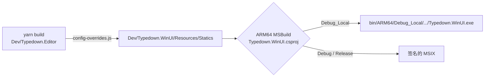

# 构建、运行与测试

## 概念

| 术语 | 含义 |
|---|---|
| 前端产物 | `yarn build` 生成的页面文件，落在 `Dev/Typedown.WinUI/Resources/Statics`（已 gitignore），宿主构建时拷进输出目录与安装包 |
| `Debug_Local` | 免打包、免签名的日常开发配置，直接运行 exe；只定义 `MODE_DEBUG_LOCAL`，**不定义 `DEBUG`** |
| `Debug` / `Release` | MSIX 打包并签名的配置；`Debug` 定义 `DEBUG` |
| 开发证书 | 自签代码签名证书 `CN=Typedown WinUI Dev Test`，与 [Package.appxmanifest](../Dev/Typedown.WinUI/Package.appxmanifest) 的 Publisher 一致 |

## 架构

MSBuild 不会构建前端：[Typedown.Editor.esproj](../Dev/Typedown.Editor/Typedown.Editor.esproj) 的构建命令为空，并用空的 `DebugEnsureNodeEnv` 目标阻止 JavaScript SDK 在构建时执行 `npm install`。前端必须先手动构建，宿主构建只负责收集产物。



## 分点解释

### 1. 环境

需要 Visual Studio 2026（18.x），带 WinUI / Windows 应用开发工作负载和 ARM64 生成工具；.NET 10 SDK；Node.js 与 Yarn Classic 1.22。Node 25 起官方发行版不再自带 corepack，用 `npm i -g yarn` 安装 yarn。前端是 Yarn 1 工程（`yarn.lock`），不要用 `npm install`。

### 2. 构建前端

首次在 `Dev/Typedown.Editor` 下执行 `yarn` 安装依赖，之后每次改动前端都执行 `yarn build`。输出目录由 [config-overrides.js](../Dev/Typedown.Editor/config-overrides.js) 决定，默认是 `../Typedown.WinUI/Resources/Statics`，可用环境变量 `TYPEDOWN_EDITOR_BUILD_OUTPUT`（相对 `Dev/Typedown.Editor`）改写。宿主的 `Debug_Local` 与 `Release` 构建在找不到 `Resources/Statics/index.html` 时直接报错；`Debug` 不检查，缺产物时编辑区会是空白。

`Debug` 配置下宿主会先探测 `http://localhost:3000`：`yarn start` 的开发服务器在线就加载它，否则加载本地产物，并自动打开 DevTools，同时 WebView2 开启 `--remote-debugging-port=9222`。`Debug_Local` 不定义 `DEBUG`，这些调试能力都不生效。

### 3. 构建与运行宿主

本项目的构建验证一律使用 **ARM64 MSBuild**（见仓库根的 [CLAUDE.md](../CLAUDE.md)），位于 `C:\Program Files\Microsoft Visual Studio\18\<版本>\MSBuild\Current\Bin\arm64\MSBuild.exe`：

```powershell
& $msbuild Dev\Typedown.WinUI\Typedown.WinUI.csproj /p:Configuration=Debug_Local /p:Platform=ARM64
```

支持的平台是 `ARM64` 与 `x64`。`Debug_Local` 的产物在 `Dev/Typedown.WinUI/bin/ARM64/Debug_Local/net10.0-windows10.0.26100.0/win-arm64/Typedown.WinUI.exe`。应用是单实例的，再次启动会把激活转交给已运行的实例；需要一个独立的新窗口（例如与正在用的窗口并行测试）时，带 `--typedown-new-window` 参数启动。

### 4. 打包与签名

`Debug` / `Release` 用 [Typedown.WinUI.csproj](../Dev/Typedown.WinUI/Typedown.WinUI.csproj) 中 `PackageCertificateThumbprint` 指定的证书签名，该证书必须存在于 `Cert:\CurrentUser\My` 且带私钥，否则 VS 的 `Typedown.WinUI (Package)` 启动配置无法构建。换机或证书丢失时重建并更新指纹：

```powershell
$cert = New-SelfSignedCertificate -Type CodeSigningCert -Subject "CN=Typedown WinUI Dev Test" `
    -CertStoreLocation Cert:\CurrentUser\My -KeyExportPolicy Exportable
$cert.Thumbprint   # 写回 csproj 的 PackageCertificateThumbprint
```

Subject 必须与 manifest 的 Publisher 保持一致。证书可导出为 pfx 备份。

### 5. 测试

测试项目有两个，`dotnet test` 一次只能指定一个项目：

```powershell
dotnet test Tests\Typedown.ArchitectureTests\Typedown.ArchitectureTests.csproj
dotnet test Tests\Typedown.CoreTests\Typedown.CoreTests.csproj
```

`ArchitectureTests` 校验分层依赖与安装包清单的文件关联，`CoreTests` 覆盖 Core 的服务与模型。

### 6. 已知问题

- 生成整个解决方案时，`Tools/TranslationTool` 报 `NETSDK1127`（缺少 Microsoft.NETCore.App 目标包），不影响宿主；直接构建 `Typedown.WinUI.csproj` 即可避开。
- `AboutPage.xaml` 与 `SettingsPage.xaml` 各有一条 `WMC1506` 绑定警告，属既有问题。
