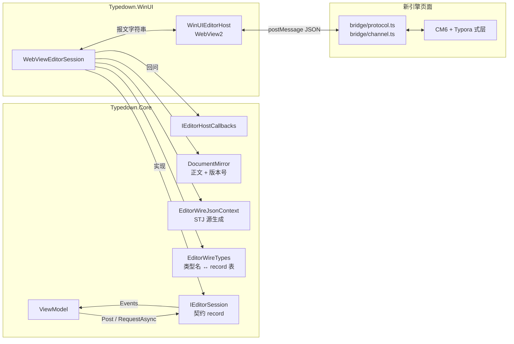
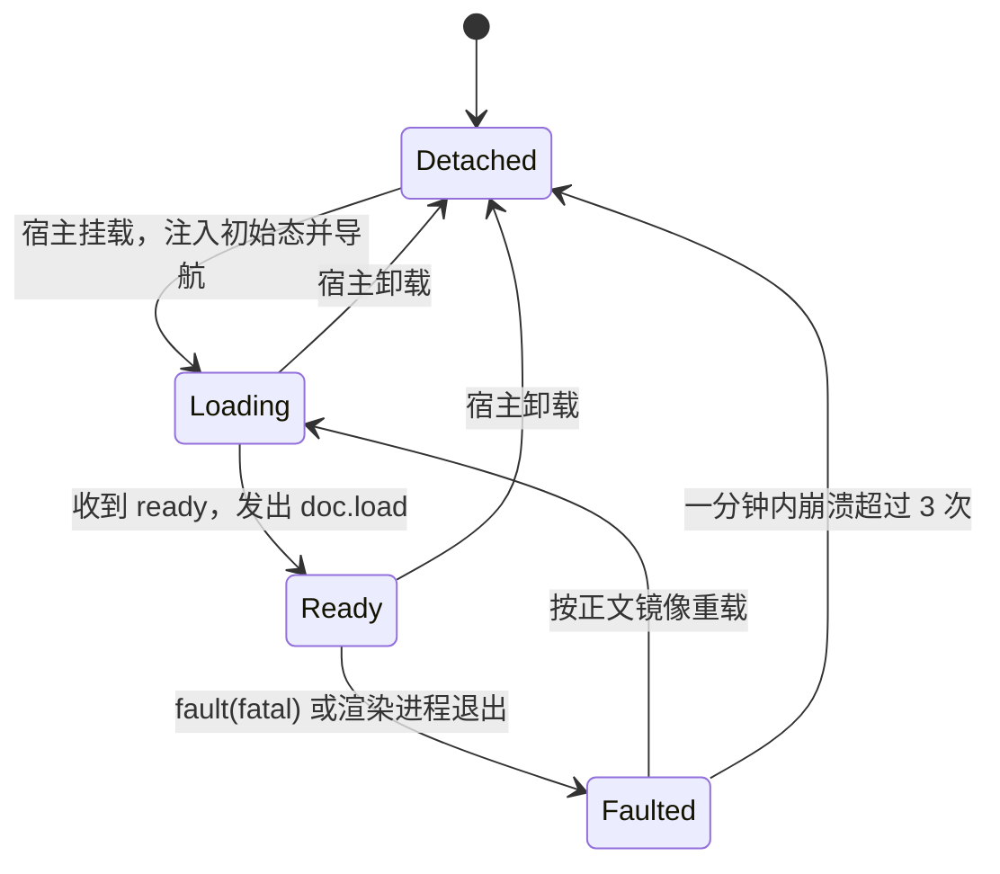
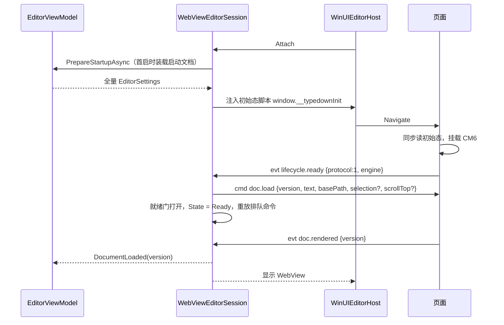
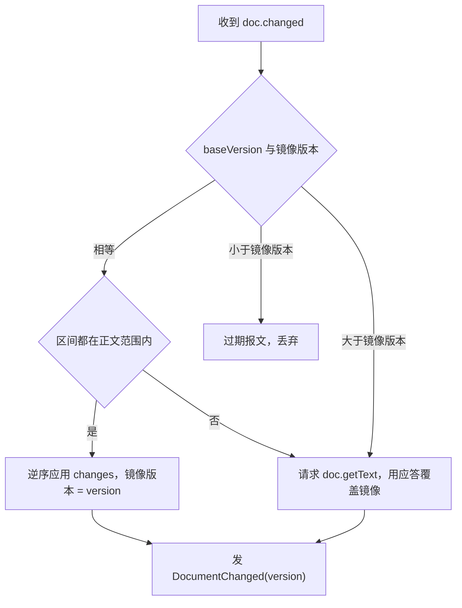
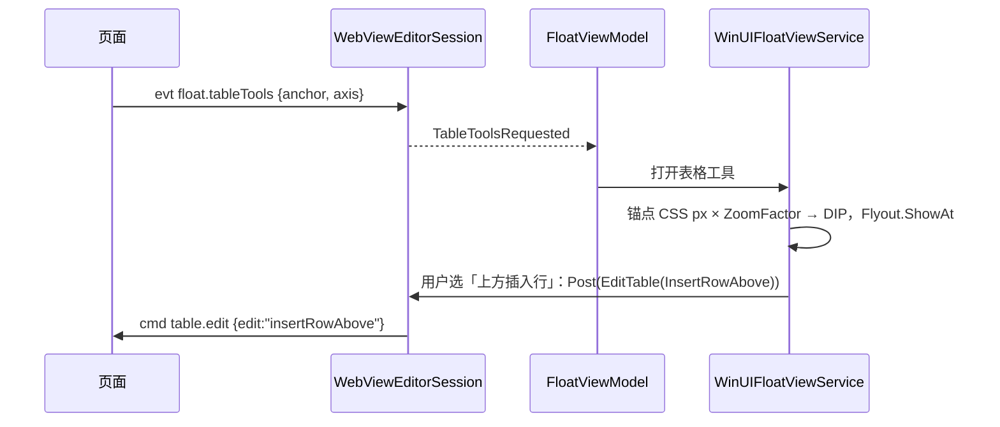
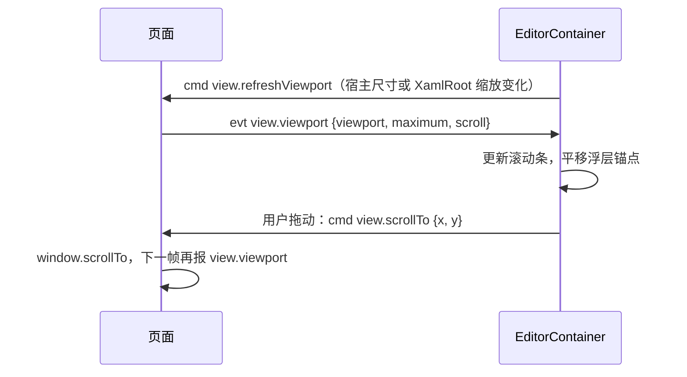
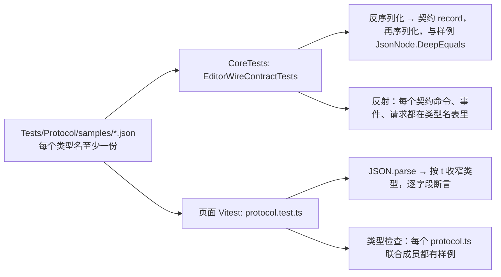

# 编辑器桥接协议 v1

基于集成分支 `work/p0-host-prep` 的 `ed4fb6f3`（编辑会话契约定型）；新引擎页面与宿主侧 `WebViewEditorSession` 都按本文实现，现有 Muya 页面仍走 [architecture.md](architecture.md) 第 4–5 节的旧协议。

## 概念

| 术语 | 含义 |
|---|---|
| 契约 | Core 里的 [IEditorSession](/Dev/Typedown.Core/Editor/IEditorSession.cs) 及其命令、事件、请求 record，ViewModel 只认识它，与引擎和线格式无关 |
| 线协议 | 宿主与新引擎页面之间经 `postMessage` 传递的 JSON 报文格式，即本文 |
| 会话 | 契约的实现。`LegacyMuyaSession` 翻译旧协议，`WebViewEditorSession` 实现本协议；两者对 ViewModel 完全等价 |
| 信封 | 每条报文的外层：种类 `k`、类型名 `t`、载荷 `p`，请求与应答另带 `id` |
| 类型名 | `领域.动作` 形式的字符串，例如 `format.toggle`；它只存在于线上，两端代码里各自映射成类型 |
| 正文镜像 | 宿主持有的一份正文副本与版本号，保存、备份、脏标记、崩溃恢复都读它 |
| 版本号 | 正文的单调递增整数。宿主装载时指定，页面每发一批增量加一 |
| 初始态 | 导航前注入页面的设置、主题、快捷键表与语言，页面启动时同步读取，不需要往返 |
| DIP | 与设备无关的像素，XAML 的坐标单位；页面坐标是 CSS px，两者差一个 `ZoomFactor` |

## 架构

契约是唯一的对外形状，线协议是它的一种编码。绝大多数命令和事件与契约 record 一一对应，由会话按类型名表直接序列化；只有正文同步、生命周期和几条回问宿主的请求是线上独有的，由会话自己消化，不暴露给 ViewModel。

一次完整的生命周期：注入初始态 → 页面报 `lifecycle.ready` → 宿主发 `doc.load` → 页面报 `doc.rendered`、宿主显示 WebView → 双向的命令、事件、请求 → 页面报 `lifecycle.fault` 或渲染进程退出时按正文镜像重载。

## 分点解释

### 1. 契约、线协议与会话的分工

线协议不另起一套词汇：契约 record 的属性就是载荷字段，契约枚举就是载荷里的枚举值。这样页面发来的事件反序列化后直接就是 ViewModel 订阅的那个 record，新会话没有翻译层，只有三类报文由会话自己处理：

| 类别 | 报文 | 会话怎么处理 |
|---|---|---|
| 生命周期 | `lifecycle.ready`、`lifecycle.fault` | 驱动 `EditorSessionState` 与就绪门、崩溃恢复，不外发事件 |
| 正文同步 | `doc.load`、`doc.changed`、`doc.flush`、`doc.getText` | 维护 `DocumentMirror`，对外只发不带正文的 `DocumentChanged(Version)`（第 4 节） |
| 回问宿主 | `table.pickSize`、`clipboard.write`、`image.resolve` | 调 [IEditorHostCallbacks](/Dev/Typedown.Core/Editor/IEditorHostCallbacks.cs) 的对应方法，把结果作为应答 |

类型名与 record 的对应集中在 Core 的一张表 `EditorWireTypes`（`Type ↔ string` 双向字典，外加每个类型的 `JsonTypeInfo`），不用 `[JsonPolymorphic]` 标注契约 record：契约不该知道自己在线上叫什么，旧协议适配器也用不到这些名字。页面侧的 `bridge/protocol.ts`（在 `work/editor-next` 分支的 Dev/Typedown.Editor 下）是同一张表的 TypeScript 版本，每个类型名一个 interface，按 `t` 组成可辨识联合。

### 2. 信封与 JSON 约定

| 种类 `k` | 形状 | 方向 |
|---|---|---|
| `cmd` | `{"k":"cmd","t":"format.toggle","p":{"mark":"strong"}}` | 宿主→页面，即发即走 |
| `evt` | `{"k":"evt","t":"history.changed","p":{"canUndo":true,"canRedo":false}}` | 页面→宿主，即发即走 |
| `req` | `{"k":"req","id":17,"t":"doc.flush","p":{}}` | 双向 |
| `res` | `{"k":"res","id":17,"ok":true,"p":{"version":43}}` 或 `{"k":"res","id":17,"ok":false,"err":{"code":"canceled","message":"…"}}` | 双向，回应对方的 `req` |

- **载荷永远是对象。** 无字段的 record（`Undo`、`SelectAll` 等）发 `{}`，字段多了少了都不影响解析：未知字段忽略，缺失字段取类型默认值；必填字段缺失按 `invalidPayload` 处理。
- **信封外层手写。** 宿主用 `Utf8JsonWriter` 写 `k`、`t`、`id`，载荷用 `EditorWireJsonContext` 的 `JsonTypeInfo` 写入 `p`；读取时先用 `Utf8JsonReader` 取出 `k`、`t`、`id`，再按类型名表反序列化 `p`。这样不依赖 STJ 多态，也不要求 `t` 出现在第一个字段。
- **命名。** 字段名 camelCase；枚举值写成 camelCase 字符串（`"strong"`、`"heading2"`、`"insertRowAbove"`），用 `JsonStringEnumConverter` 配 camelCase 命名策略。唯一的例外是 `KeyboardKey` 与 `KeyboardModifiers`：它们是 Win32 虚拟键码与标志位，页面按 `KeyboardEvent.keyCode` 与修饰键位直接比较，写成整数。
- **标识。** `HeadingId` 这类 `readonly record struct` 包装在线上展开成它的字符串值（`"id":"h-3f2a"`），由自定义转换器处理，页面只把它当不透明字符串。
- **偏移。** 正文中的一切位置都是 UTF-16 码元偏移，基于只含 `\n` 换行的正文。JS 字符串下标与 C# `string` 下标天然一致，两端不做换算。
- **数字。** 版本号与请求 id 是非负整数，最大不超过 2^53，JS `number` 安全表示。坐标是 `double`，单位见第 7 节。
- **转义。** 宿主序列化用 `UnsafeRelaxedJsonEscaping`，中文与 HTML 原样输出；页面用 `JSON.stringify`。两端只约定解析后的值，不约定字节形态。
- **传输。** 宿主→页面走 `CoreWebView2.PostWebMessageAsString`，页面→宿主走 `chrome.webview.postMessage(string)`；两端都传 JSON 字符串，不用 `PostWebMessageAsJson`，免得宿主先被解析成 COM 对象再序列化一遍。

### 3. 生命周期与启动握手

- **初始态。** 会话调 `AddScriptToExecuteOnDocumentCreated` 注入一行 `window.__typedownInit = {...}`，内容是 `EditorInitState(Protocol, Settings, Theme, Keymap, Locale)`：全量 `EditorSettings`、`EditorTheme`、快捷键和弦表、界面语言代码。页面自带的少量界面文字（补全列表的空状态等）按 `locale` 取自己的资源，不再有 `GetStringResources`。每次导航前，会话先移除上一次注入的脚本再注入最新值，所以页面重载拿到的总是当下状态。
- **ready。** 页面挂载完 CM6、能接收 `doc.load` 时发出，载荷 `{protocol, engine}`。`protocol` 与宿主不一致时，会话记日志并进入 `Faulted`，不重试；`engine` 是版本描述，只进日志。
- **doc.load 与就绪门。** 会话收到 `ready` 后先发 `doc.load`，紧接着打开 [EditorCommandGate](/Dev/Typedown.Core/Editor/EditorCommandGate.cs) 并重放排队命令。WebView2 的消息通道保序，排队命令一定排在 `doc.load` 之后到达。门的规则沿用 P0：门关时普通命令按序排队（上限 128，满了丢最旧）；主题、快捷键表、视口刷新只留最新一份；设置增量合并成一份；宿主卸载期间保留，重新挂载后重放。初始态已经含有注入时刻的设置、主题与快捷键表，重放的只是注入之后的变化。
- **rendered。** 页面首屏画完（首个视口的装饰与块组件就绪）发 `doc.rendered {version}`，会话据此发契约事件 `DocumentLoaded(Version)`，宿主此时才让 WebView 可见，不再出现空编辑区的一帧。每次 `doc.load` 都对应一次 `doc.rendered`；版本号不等于最近一次 `doc.load` 的，说明是过期的回声，丢弃。
- **fault。** 页面把 `window.onerror`、`unhandledrejection` 与 CM6 的 `EditorView.exceptionSink` 都接到 `lifecycle.fault {message, stack, fatal}`。`fatal:false` 只记日志；`fatal:true` 表示编辑器状态不可信，会话进入 `Faulted` 并重载页面。同一 `message + stack` 在一次页面生命周期内只上报一次。
- **重载恢复。** 渲染进程退出与致命 fault 走同一条路径，由 [EditorCrashRecovery](/Dev/Typedown.Core/Editor/EditorCrashRecovery.cs) 决定：一分钟内超过 3 次不再自动重载；距上次崩溃不少于 15 秒时，`doc.load` 带上崩溃前最后一次 `selection.changed` 的选区与最后一次 `view.viewport` 的滚动位置。正文取镜像，镜像最多落后页面一帧（第 4 节）。重载时挂起的宿主→页面请求一律以 `OperationCanceledException` 结束。

### 4. 正文同步

正文的真相在页面，宿主持一份带版本号的镜像。页面每个动画帧最多发一条 `doc.changed`，载荷只含改动；保存等需要精确正文的操作先 `doc.flush`，镜像对不上时用 `doc.getText` 整体重同步。

| 报文 | 方向 | 载荷 | 说明 |
|---|---|---|---|
| `doc.load` | cmd | `{version, text, basePath, selection?, scrollTop?}` | 整篇替换正文并清空撤销历史。`version` 由宿主分配，严格大于此前出现过的任何版本号；`selection` 是 `{anchor, head}` |
| `doc.changed` | evt | `{baseVersion, version, changes:[{from, to, insert}]}` | `version = baseVersion + 1`；`changes` 按 `from` 升序、互不重叠，偏移都相对于 `baseVersion` 的正文 |
| `doc.rendered` | evt | `{version}` | 见第 3 节 |
| `doc.flush` | req | `{}` → `{version}` | 页面先同步发出挂起的 `doc.changed`，再应答当前版本号 |
| `doc.getText` | req | `{}` → `{version, text}` | 取页面当前全文与版本号 |

页面侧的做法：CM6 每个改动正文的事务把 `ChangeSet` 合成进一个待发的累积 `ChangeSet`（`ChangeSet.compose`），`requestAnimationFrame` 回调里用 `iterChanges((fromA, toA, _, __, inserted) => ...)` 展开成 `{from, to, insert}` 列表发出。这是引擎无关的形状，宿主不需要认识 CM6 的 `ChangeSet.toJSON` 格式。撤销、重做、命令执行、`doc.importHtml` 引起的正文变化都走这同一条路径。

- **过期与失步。** 宿主发 `doc.load` 后，页面在它之前已发出的 `doc.changed` 仍可能在途，它们的 `baseVersion` 小于新装载的版本号，直接丢弃；这就是装载版本号必须严格递增的原因，也因此不需要 `docId`。`baseVersion` 大于镜像版本只会在丢报文或实现有错时出现，按失步处理。重同步期间到达的 `doc.changed` 暂存，拿到 `getText` 应答后只应用版本号更大的那些。
- **谁读镜像。** 契约的 `DocumentChanged` 与 `DocumentLoaded` 只带版本号，ViewModel 需要正文时读 `Session.Document.Text`。自动保存与备份直接读镜像（最多落后一帧）；手动保存、另存为、导出、关闭窗口前先 `await RequestAsync(new FlushDocument())`，再读镜像写盘，并以 flush 返回的版本号记为保存点。`doc.flush` 超时 1 秒时，会话记日志、按当前镜像继续保存，不阻塞用户。
- **换行与编码。** 页面只见 `\n`。宿主读文件时记下编码、BOM 与原换行符（`\r\n` / `\n` / 混合时取占多数者），`doc.load` 前统一成 `\n`，保存时还原。这与引擎的「打开不改写正文」一起构成字节保真：打开后不编辑直接保存，文件字节不变。
- **撤销在页面。** 新引擎用 CM6 自己的 `history`，页面以 `history.changed` 报告可撤销状态；宿主不再持有 `ContentHistory` 快照，`Undo` / `Redo` / `ClearUndoHistory` 只是转发给页面的命令。
- **镜像的代价。** 镜像多占一份正文内存（1 MB 文档约 2 MB UTF-16），每批增量的应用是 O(改动 + 块移动)；比旧协议每键全文加字符串差分便宜得多。

### 5. 消息清单

命令（宿主→页面，`cmd`）。载荷字段就是契约 record 的属性，camelCase：

| 领域 | 类型名 | 契约 record | 载荷 |
|---|---|---|---|
| doc | `doc.load` | `LoadDocument`（会话补版本号，见第 4 节） | `{version, text, basePath, selection?, scrollTop?}` |
| doc | `doc.importHtml` | `ImportHtml` | `{html}` |
| history | `history.undo` / `history.redo` / `history.clear` | `Undo` / `Redo` / `ClearUndoHistory` | `{}` |
| selection | `selection.selectAll` / `selection.delete` | `SelectAll` / `DeleteSelection` | `{}` |
| clipboard | `clipboard.copy` | `Copy` | `{format}`：`rich` / `plainText` / `markdown` / `html` |
| clipboard | `clipboard.cut` | `Cut` | `{}` |
| clipboard | `clipboard.paste` | `Paste` | `{format, text, html}` |
| format | `format.toggle` | `ToggleInlineMark` | `{mark}`：`InlineMark` |
| format | `format.clear` | `ClearInlineMarks` | `{}` |
| block | `block.setKind` | `SetBlockKind` | `{kind}`：`BlockKind` |
| block | `block.promote` / `block.demote` | `PromoteHeading` / `DemoteHeading` | `{}` |
| block | `block.insert` | `InsertParagraph` | `{position}`：`before` / `after` |
| block | `block.delete` / `block.duplicate` / `block.menuClosed` | `DeleteParagraph` / `DuplicateParagraph` / `BlockMenuClosed` | `{}` |
| table | `table.insert` | `InsertTable` | `{rows, columns}` |
| table | `table.edit` | `EditTable` | `{edit}`：`TableEdit` |
| image | `image.insert` | `InsertImage` | `{src, alt?, title?}` |
| image | `image.replace` | `ReplaceImage` | `{target, src, alt?, title?}` |
| image | `image.toolbarAction` | `ApplyImageToolbarAction` | `{action}`：`ImageToolbarAction` |
| image | `image.zoom` | `SetImageZoom` | `{percent}` |
| search | `search.set` | `Search` | `{query?, options:{caseSensitive, wholeWord, regex}}` |
| search | `search.step` | `FindMatch` | `{direction}`：`next` / `previous` |
| search | `search.replace` | `Replace` | `{query?, replacement, all, options}` |
| search | `search.end` | `EndSearch` | `{}` |
| outline | `outline.reveal` | `RevealHeading` | `{id}` |
| view | `view.settings` | `ApplySettings` | `{changes}`：只含非空字段的 `EditorSettings` |
| view | `view.theme` | `ApplyTheme` | `{theme:{isDark, accent:{r,g,b,a}, background:{r,g,b,a}}}` |
| view | `view.keymap` | `SetKeymap` | `{chords:[{key, modifiers}]}` |
| view | `view.scrollTo` | `ScrollTo` | `{x, y}` |
| view | `view.refreshViewport` | `RefreshViewport` | `{}` |

事件（页面→宿主，`evt`）：

| 领域 | 类型名 | 契约 record | 载荷 |
|---|---|---|---|
| lifecycle | `lifecycle.ready` / `lifecycle.fault` | 无，会话自用 | `{protocol, engine}` / `{message, stack?, fatal}` |
| doc | `doc.changed` / `doc.rendered` | `DocumentChanged` / `DocumentLoaded`（只带版本号） | 见第 4 节 |
| history | `history.changed` | `HistoryChanged` | `{canUndo, canRedo}` |
| selection | `selection.changed` | `SelectionChanged` | `{hasText, text, rich?, anchor, head}`；`rich` 为 `null` 表示源码模式 |
| selection | `selection.marks` | `MarksChanged` | `{marks:[InlineMark]}` |
| outline | `outline.changed` | `OutlineChanged` | `{items:[{id, level, text}], current?}` |
| stats | `stats.changed` | `StatsChanged` | `{characters, words}` |
| search | `search.result` | `SearchResultChanged` | `{count, current}`；`current` 从 1 起，无匹配时为 0 |
| view | `view.viewport` | `ViewportChanged` | `{viewportWidth, viewportHeight, maximumX, maximumY, scrollX, scrollY}` |
| view | `view.shortcut` | `ShortcutPressed` | `{key, modifiers}`（整数） |
| view | `view.openLink` | `LinkOpenRequested` | `{uri}` |
| float | `float.blockMenu` / `float.formatPicker` / `float.imageToolbar` | `BlockMenuRequested` / `FormatPickerRequested` / `ImageToolbarRequested` | `{anchor?}` |
| float | `float.imageEditor` | `ImageEditorRequested` | `{anchor?, image:{src, alt, title}}` |
| float | `float.tableTools` | `TableToolsRequested` | `{anchor?, axis}` |
| float | `float.tooltip` / `float.tooltipDismissed` | `TooltipRequested` / `TooltipDismissed` | `{kind, anchor?}` / `{}` |

`selection.changed` 的 `text` 只为查找框预填而存在：选区是单行且不超过 200 个 UTF-16 码元时给出原文，否则给空串，避免大选区每帧过桥。`anchor` 与 `head` 是正文偏移，供崩溃恢复使用；契约 `SelectionChanged` 不暴露它们，会话自己留存最后一份。

请求（`req` / `res`）：

| 方向 | 类型名 | 契约或回调 | 载荷 → 应答 |
|---|---|---|---|
| 宿主→页面 | `doc.flush` | 请求 `FlushDocument : EditorRequest<long>` | `{}` → `{version}` |
| 宿主→页面 | `doc.getText` | 会话自用 | `{}` → `{version, text}` |
| 宿主→页面 | `export.renderHtml` | 请求 `RenderExportHtml : EditorRequest<string>` | `{purpose, title, basePath?, options?}` → `{html}` |
| 宿主→页面 | `selection.contextAt` | 请求 `ContextAt : EditorRequest<RichSelection?>` | `{x, y}` → `RichSelection` 或 `null`（坐标不在正文上） |
| 页面→宿主 | `table.pickSize` | `IEditorHostCallbacks.PickTableSizeAsync` | `{}` → `{rows, columns}` 或 `null`（用户取消） |
| 页面→宿主 | `clipboard.write` | `IEditorHostCallbacks.WriteClipboardAsync` | `{plainText?, html?}` → `{}` |
| 页面→宿主 | `image.resolve` | `IEditorHostCallbacks.ResolveImageAsync` | `{source:{kind, value}}` → `{src}` 或 `null`（放弃插入） |

`image.resolve` 处理粘贴与拖入的图片：`kind` 为 `filePath`（拖入的文件，经 `postMessageWithAdditionalObjects` 取到路径）、`dataUrl`（剪贴板位图）或 `webUrl`（粘贴的网络图片），宿主按设置执行复制到本地目录或上传，返回写进正文的地址。页面在应答前不改正文，应答为 `null` 就什么都不插。

### 6. 频率与合并

| 报文 | 规则 | 理由 |
|---|---|---|
| `doc.changed` | 每个动画帧最多一条，同一帧内的事务合成一批；载荷与改动大小成正比 | 连续输入与粘贴时桥上开销与文档长度无关 |
| `selection.changed`、`selection.marks` | 每帧合并；与上一次发出的内容相同则不发 | 拖选时每帧只有一次 |
| `history.changed` | 只在 `canUndo` 或 `canRedo` 翻转时发 | 两个布尔值，绝大多数按键不会改变 |
| `stats.changed` | 空闲 300 ms 去抖，值不变不发 | 字数统计要遍历全文 |
| `outline.changed` | 标题的层级、文本或顺序变化时发；`current` 变化时也发 | 普通段落里打字不触发 |
| `view.viewport` | 滚动与尺寸变化时每帧最多一条；宿主 `view.refreshViewport` 后下一帧必发 | 驱动 XAML 滚动条，见第 8 节 |
| `search.result` | 每次 `search.set` / `search.step` / `search.replace` 后一条；正文变化使计数改变时也发一条 | 查找栏显示「第 n / 共 m 处」 |
| `view.settings`、`view.keymap`、`view.theme` | 宿主侧就绪门合并成一份最新值 | 设置页里连续调整只下发最终值 |

页面在同一帧里要发多条事件时，顺序固定为 `doc.changed` → `history.changed` → `selection.changed` → `selection.marks` → 其他。宿主处理 `selection.changed` 时镜像已经是同一帧的正文，偏移不会错位。

### 7. 宿主浮层与坐标

右键菜单、段落菜单、表格工具、建表尺寸、图片工具与编辑、链接提示都是宿主的 XAML Flyout，页面只发 `float.*` 事件报锚点与上下文，用户的选择以命令回到页面。输入中跟随光标的补全列表（代码块语言、`:emoji:`）是唯一留在页面里的浮层，因为 Flyout 会拿走 WebView 的键盘焦点、打断组字。

- **坐标系。** `anchor` 是 `EditorRect {x, y, width, height}`，相对 WebView 视口左上角（即 `getBoundingClientRect` 的值），单位 CSS px。页面取锚点时，行内位置用 CM6 的 `coordsAtPos`，块组件用元素的 `getBoundingClientRect`。宿主换算为 `DIP = CSS px × ZoomFactor`，不再把 CSS px 直接当 DIP；`RasterizationScale` 由 WebView2 自己处理，不参与换算。
- **右键菜单。** 宿主保留 `CoreWebView2.ContextMenuRequested`：取 deferral，把事件坐标换回 CSS px，`RequestAsync(new ContextAt(x, y))` 得到点击处的 `RichSelection`，据此决定菜单项再弹出 `MenuFlyout`。页面不能对 contextmenu 调 `preventDefault`，否则这个事件不会触发。
- **锚点跟随滚动。** 浮层打开后页面滚动时，宿主按 `view.viewport` 的滚动差平移锚点，页面不重发 `float.*`。
- **提示。** `float.tooltip` 只报 `TooltipKind`，文字由宿主本地化；鼠标离开发 `float.tooltipDismissed`。

### 8. 滚动条

竖横两条滚动条都是 [EditorContainer](/Dev/Typedown.WinUI/Controls/EditorControls/EditorContainer.xaml.cs) 里的 XAML `ScrollBar`。新引擎不给编辑器设固定高度，CM6 以窗口为滚动容器，页面隐藏原生滚动条。

- 页面把可滚动量里不超过 1 px 的部分按 0 处理：分数缩放下视口宽度是小数，`innerWidth` 与 `scrollWidth` 取整后会差 1 px。
- CM6 只渲染视口，视口外的行高是估算值，滚动到新区域时文档总高度会小幅变化，`maximumY` 随之变化，XAML 滑块会轻微跳动。页面对公式、图表缓存实测高度，对代码块、表格按行数估算，把跳动压到最小。
- `view.scrollTo` 引起的滚动同样会触发 `view.viewport`，宿主据此确认位置，不需要单独应答。

### 9. 错误、超时与版本演进

应答的 `err.code` 是封闭集合，两端对应同一个枚举 `EditorWireError`：

| code | 含义 | 发起方的处理 |
|---|---|---|
| `unknownType` | 对方不认识这个类型名 | 宿主→页面时记日志，请求以 `NotSupportedException` 结束；页面→宿主时页面走降级路径 |
| `invalidPayload` | 载荷缺必填字段或类型不对 | 记日志，视为实现缺陷，测试里断言从不出现 |
| `notReady` | 页面在 `ready` 之前收到请求 | 会话本不应发出（请求在就绪门后），出现即缺陷 |
| `canceled` | 页面重载或宿主卸载，请求作废 | 宿主侧以 `OperationCanceledException` 结束 |
| `failed` | 处理过程中抛出异常，`message` 带原因 | 以 `EditorRequestFailedException` 结束 |

- **命令和事件没有应答。** 对方不认识的 `cmd` / `evt` 只记日志并丢弃，不回 `res`，也不中断通道。
- **请求 id。** 两个方向各自从 1 开始计数、各自维护挂起表；一端只用对方的 `res` 了结自己发出的 `req`，所以两个方向的 id 可以重复。
- **超时。** 宿主→页面的请求默认 5 秒超时，`doc.flush` 1 秒（超时后的行为见第 4 节），`export.renderHtml` 60 秒。页面→宿主的请求不设超时：它们可能在等用户操作对话框。
- **版本演进。** 协议版本只有一个整数，写在初始态与 `lifecycle.ready` 里。加字段、加类型名、加枚举值都向后兼容，不升版本：旧的一方忽略不认识的字段与报文，不认识的枚举值按「丢弃这条报文」处理。删改字段或改变语义才升版本；页面与宿主同属一次发布，版本不一致只会出现在开发时的混合构建中，这时直接进入 `Faulted`。

### 10. 契约需要的调整

以下是现有契约为本协议必须做的改动，均在 C5（宿主接入）开始前完成。`LegacyMuyaSession` 同步给出旧协议下的等价实现，ViewModel 在两种会话下行为一致：

| 调整 | 原因 | 旧协议适配器怎么做 |
|---|---|---|
| `EditorDocument(string Text)` 加 `long Version` | 镜像要带版本号，保存点按版本记录 | 每次 `MarkdownChange`、装载、撤销回灌时版本加一 |
| `DocumentChanged(string Text)` 改为 `DocumentChanged(long Version)`，`DocumentLoaded` 同样只带版本号 | 事件不再携带全文；订阅者（`EditorViewModel.OnMarkdownChange`、`OnDocumentLoaded`）改读 `Session.Document.Text` | 旧页面本来就发全文，适配器更新镜像后发版本号即可，不需要算差异 |
| 新增请求 `FlushDocument : EditorRequest<long>` | 手动保存前取精确正文 | 旧页面每次变化都立即上报，直接应答当前镜像版本 |
| 新增请求 `ContextAt(double X, double Y) : EditorRequest<RichSelection?>` | 右键菜单按点击处决定菜单项 | 应答最后一次 `SelectionChanged` 的 `Rich` |
| 新增事件 `SearchResultChanged(int Count, int Current)` | 查找栏显示匹配数 | 旧页面没有这个信息，从不发出 |
| `IEditorHostCallbacks` 新增 `ResolveImageAsync(ImageSource, CancellationToken)`，`ImageSource(ImageSourceKind Kind, string Value)`，结果 `string?` | 粘贴与拖入图片由宿主落盘或上传 | 旧页面自己处理图片，从不调用 |
| 新增 `EditorInitState`、`EditorWireError`、`EditorRequestFailedException`、`EditorWireTypes` 类型名表与 `EditorWireJsonContext` | 本协议的编码 | 不涉及 |

### 11. 契约测试

两端各自的单元测试读同一批 JSON 样例，任何一端改了字段名、枚举值或类型名都会失败：

- 样例放在仓库根的 `Tests/Protocol/samples/`，文件名就是类型名（`format.toggle.json`），内容是一条完整信封。两个工作区（集成分支与 `work/editor-next`）都能访问到它。
- C# 侧额外守住：类型名表是双射；每个类型名在 `EditorWireJsonContext` 里都有 `JsonTypeInfo`（AOT 下缺失会在运行时才失败）；枚举的线上值集合与样例里出现的一致。
- 页面侧的 `protocol.ts` 由人手维护而不是代码生成：契约只有几十个 record，生成器的维护成本高于对照表，漏改会被上面两条测试拦下。
