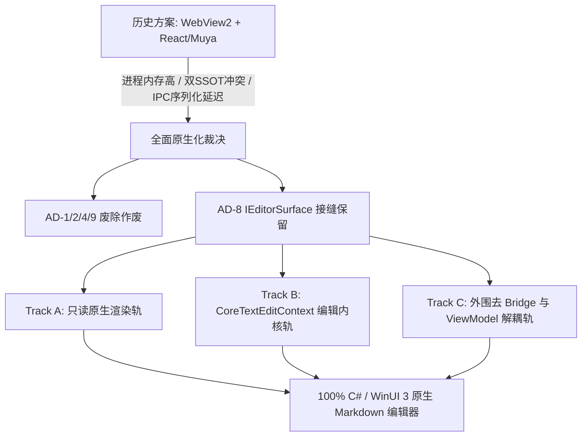

# Typedown Native Migration Target Architecture

> **状态**：唯一生效架构规范 (Authoritative Active Architecture Specification)  
> **版本**：2.0.0 (W0-Solidified)  
> **基线分支**：`winui3-migration` / `work/nat-w0-baseline`  
> **生效时间**：2026-08-24  

---

## 1. 战略决策与目标愿景 (Executive Summary & Decisions)

本项目正式决定对 Typedown 编辑器实施**全面原生化架构演进**，彻底移除基于 Chromium / WebView2 + React / Muya 的多进程混合编辑方案，转为纯 C# 与 WinUI 3 原生渲染与编辑架构。



### 1.1 裁决背景与问题剖析

原有 `WebView2 + React/Muya` 方案在演进过程中暴露了不可调和的系统性瓶颈：
1. **多进程与内存开销**：每个窗口均需拉起独立 WebView2 渲染进程，冷启动耗时过长，基础常驻内存高达 200MB+。
2. **状态源割裂 (Split SSOT)**：Muya 维护 JavaScript 端的 AST/JSON 状态树，Host (C#) 维护 ViewModel 与本地文件状态，跨进程增量同步 (`diffmsg`) 存在死锁与并发一致性风险。
3. **IME 与平台集成割裂**：Web DOM 内核的输入法合成、手写笔、触控与辅助功能难以无缝接入 Windows 原生 Text Services Framework (TSF)。
4. **构建与打包复杂度**：依赖 node/yarn/webpack 工具链，导致跨平台编译矩阵与 ARM64 交叉编译面临极高脆弱性。

### 1.2 架构决策裁决记录

| 决策 ID | 决策项 | 裁决结果 | 说明 |
| :--- | :--- | :--- | :--- |
| **AD-1** | 双向 JSON-RPC 跨进程桥接协议 | **作废 (REVERSED)** | 原生编辑直接通过 C# 内存接口调用，彻底废弃 IPC 消息序列化。 |
| **AD-2** | Muya JS 状态为 Single Source of Truth | **作废 (REVERSED)** | C# 端 `Typedown.Core.Markdown` AST 模型为唯一可信状态源。 |
| **AD-4** | 基于 React / HTML DOM 视图管线 | **作废 (REVERSED)** | 废除 Web DOM，由 WinUI 3 XAML RichTextBlock / DirectWrite 控件原生承载。 |
| **AD-8** | EditorSurface 抽象接缝 | **保留并继承 (ACTIVE)** | 定义 `IEditorSurface` 接口，隔离 ViewModel 与具体编辑器表面实现。 |
| **AD-9** | 基于 Web Selection API 的跨进程选区同步 | **作废 (REVERSED)** | 原生 `CoreTextEditContext` 和 C# `TextSelection` 统一管理光标与选区。 |

---

## 2. 三轨并行实施路线 (Three-Track Parallel Roadmap)

为降低研发风险并支持多 Agent / 多 Worktree 并发协同，原生化拆解为三大独立演进轨道：

```text
┌─────────────────────────────────────────────────────────────────────────────┐
│                          Track A: 只读原生渲染轨                            │
│  - Markdig AST 原生解析树                                                   │
│  - WinUI 3 XAML 元素映射 (Heading, Paragraph, Table, List, Code, Quote)    │
│  - 语法高亮 (C# 原生 Tokenizer) 与只读预览流水线                           │
└─────────────────────────────────────────────────────────────────────────────┘
                                      ▲
                                      │ 共享 Markdig AST 与渲染块视图
                                      ▼
┌─────────────────────────────────────────────────────────────────────────────┐
│                   Track B: CoreTextEditContext 编辑内核轨                   │
│  - Windows.UI.Text.Core.CoreTextEditContext 输入法与 TSF 原生集成          │
│  - 块级增量重解析 (Incremental Block Reparser) 与光标/选区定位              │
│  - 原生 Undo/Redo 历史记录栈                                                │
│  - CSharpMath 数学公式渲染 & Mermaid 局部宿主回退 Spike 定价               │
└─────────────────────────────────────────────────────────────────────────────┘
                                      ▲
                                      │ 通过 IEditorSurface 契约对接
                                      ▼
┌─────────────────────────────────────────────────────────────────────────────┐
│                   Track C: 外围去 Bridge 与契约解耦轨                       │
│  - 废除 IEditorBridge / RemoteInvoke / JSON 消息通道                        │
│  - EditorViewModel / FileViewModel / FormatViewModel 统一接入 IEditorSurface│
│  - Feature Toggle 动态切换 WebView2MuyaEditorSurface / NativeEditorSurface │
│  - 弹窗、查找替换、快捷键、文件持久化全链路去 JS 桥接化                     │
└─────────────────────────────────────────────────────────────────────────────┘
```

### Track A: 只读原生渲染轨 (Native Read-Only Rendering)
- **目标**：在 WinUI 3 中实现 100% 原生的 Markdown 文档静态与预览渲染。
- **技术栈**：Markdig 解析器、XAML `RichTextBlock` / `Paragraph` / `InlineUIContainer` / `Canvas` / 自定义 Block 视图控件。
- **交付物**：
  - `Typedown.Core.Markdown` 解析与 AST 映射。
  - `Typedown.WinUI.Rendering` 渲染器。
  - 原生 Markdown 预览视图控件。

### Track B: CoreTextEditContext 编辑内核轨 (Native Edit Kernel & Spikes)
- **目标**：构建高性能、原生富文本 Markdown 编辑交互内核。
- **技术栈**：`Windows.UI.Text.Core.CoreTextEditContext`、`TextPosition` / `TextRange`、自定义光标绘制、IME 输入缓冲、块级局部增量解析。
- **Spike 验证与风险定价**：
  - **CSharpMath Spike**：验证 `CSharpMath.WinUI` 原生渲染 LaTeX 公式的排版质量与包尺寸。
  - **Mermaid Fallback Spike**：为流程图/时序图提供轻量化隔离宿主回退（离屏 SVG 渲染或极简轻量 WebView 隔离宿主）。
- **交付物**：`NativeEditorSurface` 核心控件、编辑动作调度器、Undo/Redo 历史栈。

### Track C: 外围去 Bridge 与契约解耦轨 (Peripheral De-bridging & Decoupling)
- **目标**：重构 ViewModel 与外围服务，全面切断旧 Web Bridge，对接 `IEditorSurface`。
- **重构点**：
  - `EditorViewModel` 移除 `RemoteInvoke` 依赖，直接绑定 `IEditorSurface` 的属性与事件。
  - `FileViewModel`、`FormatViewModel`、`FloatViewModel` 通过 `IEditorSurface` 执行格式化与文件装载。
  - 接入 `IEditorSurfaceFactory` 与 Feature Toggle，支持双引擎动态无缝切换。
- **交付物**：解耦后的 Presentation ViewModel、`IEditorSurfaceFactory` 实现。

---

## 3. 模块架构与命名空间划分 (Modules & Namespaces)

```text
┌──────────────────────────────────────────────────────────────────────┐
│                           Typedown.WinUI                             │
│  - Controls/Editor/ (NativeEditorSurface, WebView2MuyaEditorSurface) │
│  - Rendering/ (MarkdownXamlRenderer, BlockRenderers, SyntaxHighlighter)│
│  - Services/ (WinUIDispatcher, WinUIDialogService, WinUIClipboard)   │
│  - Views/ & Shell Activation                                         │
└──────────────────────────────────┬───────────────────────────────────┘
                                   │ references
                                   ▼
┌──────────────────────────────────────────────────────────────────────┐
│                        Typedown.Presentation                         │
│  - ViewModels/ (EditorViewModel, FileViewModel, FormatViewModel, ...)│
│  - Interfaces/ (IUiDispatcher, IClipboard, IDialogService, ...)      │
│  - Services/ (Presentation orchestration, FormatServices)            │
└──────────────────────────────────┬───────────────────────────────────┘
                                   │ references
                                   ▼
┌──────────────────────────────────────────────────────────────────────┐
│                            Typedown.Core                             │
│  - Interfaces/ (IEditorSurface, IEditorSurfaceFactory, ...)          │
│  - Markdown/ (SyntaxTree, IncrementalBlockParser, AstNodes)          │
│  - Models/ (ContentState, SelectionState, History, TocItem, ...)    │
│  - Services/ & Utilities/ (Db, Backup, Paths, Common)                │
└──────────────────────────────────────────────────────────────────────┘
```

### 3.1 依赖方向与禁止规则 (Strict Boundary Guardrails)

1. **依赖方向**：`Typedown.WinUI` $\rightarrow$ `Typedown.Presentation` $\rightarrow$ `Typedown.Core`
2. **禁止反向依赖**：
   - `Typedown.Core` **严禁**引用 Presentation, WinUI, WinRT XAML, WebView2, Microsoft.UI.Xaml。
   - `Typedown.Presentation` **严禁**引用 WinUI, XAML, WebView2, Windows App SDK 平台类型。
   - `Typedown.WinUI` 不得绕过 Presentation 直接操作 Core 内部实现，除非是通过标准服务接口。
3. **命名空间规范**：
   - `Typedown.Core.Interfaces`：定义平台无关的契约接口（包括 `IEditorSurface`）。
   - `Typedown.Core.Markdown`：Markdig 扩展、AST 转换、增量解析器。
   - `Typedown.Core.Models`：选区、光标、大纲、内容模型。
   - `Typedown.Presentation.ViewModels`：MVVM 状态与命令。
   - `Typedown.WinUI.Controls.Editor`：编辑器控件实现。
   - `Typedown.WinUI.Rendering`：原生 XAML 与文本渲染流水线。

---

## 4. IEditorSurface 接缝契约与双引擎切流机制

### 4.1 IEditorSurface 接口契约定义

`IEditorSurface` 作为 AD-8 继承的核心接缝，承载 ViewModel 与物理编辑器表面的一切交互。

```csharp
namespace Typedown.Core.Interfaces
{
    public interface IEditorSurface : IDisposable
    {
        // 引擎元数据与就绪状态
        EditorEngineKind EngineKind { get; }
        bool IsLoaded { get; }
        bool IsReadOnly { get; set; }
        bool IsDirty { get; set; }
        string DocumentId { get; }
        ulong FileHash { get; set; }
        ulong CurrentHash { get; }

        // 文档装载与文本获取
        Task LoadMarkdownAsync(string markdown, string? filePath = null, string? basePath = null, CancellationToken cancellationToken = default);
        Task<string> GetMarkdownAsync(CancellationToken cancellationToken = default);
        void SetMarkdown(string markdown, string? origin = null);
        string Markdown { get; }
        void Clear();

        // 选区与光标
        TextSelectionRange Selection { get; set; }
        TextPosition CursorPosition { get; set; }
        string SelectedText { get; }
        bool HasSelection { get; }
        void Select(TextPosition start, TextPosition end);
        void SelectAll();
        void CollapseSelection();

        // 撤销 / 重做
        bool CanUndo { get; }
        bool CanRedo { get; }
        void Undo();
        void Redo();
        void ClearHistory();

        // 剪贴板与编辑操作
        void Cut();
        void Copy();
        Task PasteAsync();
        void DeleteSelection();
        void InsertText(string text);
        void InsertImage(HtmlImgTag image);
        void InsertImage(string src, string? alt = null, string? title = null);

        // 格式化与段落命令
        void ToggleBold();
        void ToggleItalic();
        void ToggleUnderline();
        void ToggleStrikethrough();
        void ToggleHighlight();
        void ToggleInlineCode();
        void ToggleInlineMath();
        void InsertLink(string url, string? text = null);
        void ClearFormat();
        void SetParagraph();
        void SetHeading(int level);
        void SetCodeBlock(string? language = null);
        void SetMathBlock();
        void SetQuoteBlock();
        void SetOrderList();
        void SetBulletList();
        void SetTaskList();
        void SetTable(int rows, int cols);
        void SetHorizontalLine();
        void SetFrontMatter();
        void SetFootnote();
        bool ExecuteCommand(string commandName, object? parameter = null);

        // 查找与替换
        void Find(string text, EditorSearchOptions? options = null);
        void FindNext();
        void FindPrevious();
        void Replace(string text, string replacement, EditorSearchOptions? options = null);
        void ReplaceAll(string text, string replacement, EditorSearchOptions? options = null);
        void ClearSearch();

        // 视图与滚动
        void ScrollToSlug(string slug);
        void ScrollToLine(int line);
        void ScrollToPosition(TextPosition position);
        ScrollState ScrollState { get; set; }
        void Focus();

        // 状态读取
        ContentState ContentState { get; }
        FormatState FormatState { get; }
        ParagraphState ParagraphState { get; }

        // 事件通知契约
        event EventHandler<EditorLoadedEventArgs>? Loaded;
        event EventHandler<EditorTextChangedEventArgs>? TextChanged;
        event EventHandler<EditorSelectionChangedEventArgs>? SelectionChanged;
        event EventHandler<EditorCursorChangedEventArgs>? CursorChanged;
        event EventHandler<EditorHistoryChangedEventArgs>? HistoryChanged;
        event EventHandler<EditorContentStateChangedEventArgs>? ContentStateChanged;
        event EventHandler<EditorFormatStateChangedEventArgs>? FormatStateChanged;
        event EventHandler<EditorScrollChangedEventArgs>? ScrollChanged;
        event EventHandler<EditorContextMenuEventArgs>? ContextMenuRequested;
    }
}
```

### 4.2 双引擎并存与平滑切流架构 (Dual-Surface Coexistence & Cutover)

```mermaid
graph TD
    subgraph Presentation Layer
        VM[EditorViewModel / FileViewModel]
    end

    subgraph Seam & Injection
        Factory[IEditorSurfaceFactory]
        Toggle{Feature Toggle: UseNativeEditor}
    end

    subgraph WinUI Editor Surfaces
        WV[WebView2MuyaEditorSurface<br/>(Transitional Legacy)]
        Native[NativeEditorSurface<br/>(100% C# / WinUI 3)]
    end

    VM -->|依赖契约| Factory
    Factory --> Toggle
    Toggle -->|false (Legacy)| WV
    Toggle -->|true (Target)| Native
    WV -.->|实现| Contract[IEditorSurface]
    Native -.->|实现| Contract
```

- **Feature Toggle 控制点**：
  - `Settings.UseNativeEditorSurface` (布尔开关) 或 `Settings.EditorEngine` (`EditorEngineKind.WebView2Muya` / `EditorEngineKind.Native`)。
  - 支持设置页面一键切换与内测分流。
- **演进割接阶段**：
  1. **Phase 0 (W0 基线固化)**：确立契约与架构，定义 `IEditorSurface` 与 `IEditorSurfaceFactory`。
  2. **Phase 1 (三轨并行交付)**：Track A 只读渲染就绪，Track B 编辑内核就绪，Track C 完成 ViewModel 解耦。
  3. **Phase 2 (双引擎并存验证)**：在内测环境默认开启 Native Surface，收集性能指标与排版兼容性反馈，Muya 作为兜底回退。
  4. **Phase 3 (全面移除 Legacy)**：删除 `WebView2MuyaEditorSurface`、删除 `Dev/Typedown.Editor` 目录、移除 `Microsoft.Web.WebView2` 依赖，完成全面原生化。

---

## 5. 关键技术假设与约束 (Key Technical Assumptions & Constraints)

### 5.1 Markdig 块级增量重解析 (Incremental Block-level Reparsing)
- **挑战**：全文档全量重解析大文件（如 10,000+ 行 Markdown）会导致 UI 掉帧。
- **方案**：
  - 维护行索引与 Block 边界映射表。
  - 用户按键输入触发文本修改时，仅向外扩展至最近的 Block 分界行（如前后双换行符或容器 Block 边界）。
  - 对脏 Block 进行局部 Markdig 重新解析，并将生成的局部 AST 节点替换入主 SyntaxTree，局部触发 XAML 视图更新。

### 5.2 Mermaid & Diagram 局部宿主回退 (Isolated Fallback)
- **挑战**：Mermaid.js / PlantUML 原生 C# 解析器生态尚不完善。
- **方案**：
  - 核心文本、表格、代码、数学公式全部原生渲染。
  - 对于 Mermaid / Diagram 图表块，采用**局部轻量回退机制**：
    - 方案 1（优先）：离屏轻量 SVG 生成器。
    - 方案 2（备用）：仅在渲染图表块时创建局部独立的轻量离屏/微型 WebView 节点或通过 CLI 工具转为矢量 SVG，彻底与主编辑器文本上下文解耦。

### 5.3 CSharpMath Spike 数学公式渲染
- **方案**：使用 `CSharpMath.WinUI` 或 `CSharpMath.SkiaSharp` 评估原生 LaTeX 渲染质量。
- **约束**：数学公式渲染需满足跨平台 DPI 自适应、行内（Inline Math `$E=mc^2$`）与块级（Display Math `$$\dots$$`）混排性能。

### 5.4 ARM64 MSBuild 构建锁机制 (Build Lock Governance)
- **约束**：主工作区在分支 merge 后统一持有全局 Build Lock 执行 ARM64 MSBuild 编译与 MSIX 打包验证。
- **分支工作区规则**：Subagent 在各 worktree 内执行标准 `dotnet build` / `dotnet test` 进行快速验证，避免在 worktree 内并发触发耗时且互斥的 ARM64 原生编译。

---

## 6. 文件所有权注册表与波次排他性约束 (File Ownership & Wave Exclusivity)

### 6.1 波次演进路线 (Wave Progression Roadmap W0 - W5)

| 波次 | 阶段目标 | 核心工作项 | 关联轨道 |
| :--- | :--- | :--- | :--- |
| **W0** | **架构基线与接缝固化** | 建立唯一生效目标架构文档，作废旧混合架构决策，固化 `IEditorSurface` 契约与工厂接口 | 全部 |
| **W1** | **三轨启动与 Spike 定价** | 启动 Track A 只读渲染、Track B 原生编辑内核及 CSharpMath/Mermaid spike 验证定价、Track C 解耦准备 | Track A/B/C |
| **W2** | **原生编辑内核与增量解析** | 实现 Markdig 块级增量重解析、TSF / `CoreTextEditContext` 光标与选区、原生撤销重做栈 | Track B |
| **W3** | **外围去 Bridge 与服务解耦** | 彻底剥离 `RemoteInvoke`，ViewModel 全量对接 `IEditorSurface`，重构快捷键与弹窗服务 | Track C |
| **W4** | **双引擎集成与切流验证** | 接入 `IEditorSurfaceFactory` 与 Feature Toggle，完成双表面并存与渲染/编辑一致性验证 | 全部 |
| **W5** | **Legacy 移除与全面原生化** | 移除 `WebView2MuyaEditorSurface`，删除 `Dev/Typedown.Editor` 目录，清理 Web 依赖与构建链 | 全部 |

### 6.2 文件所有权排他性注册表 (File Ownership Matrix)

为保证多 Agent / 多 Worktree 并发作业的安全与隔离，严禁跨权限修改：

| 实施轨道 / 阶段 | 独占负责文件范围 (Writable Ownership) | 只读参考范围 (Read-Only) | 严格禁止修改 (Forbidden) |
| :--- | :--- | :--- | :--- |
| **W0 (Architecture Baseline)** | `docs/**`<br/>`Dev/Typedown.Core/Interfaces/IEditorSurface*.cs`<br/>`Dev/Typedown.Core/Interfaces/EditorSurfaceContracts.cs` | 现有 Core / Presentation / WinUI 代码库 | `Dev/Typedown.Editor/**`<br/>所有既有业务实现文件 |
| **Track A (Native Rendering)** | `Dev/Typedown.Core/Markdown/**`<br/>`Dev/Typedown.WinUI/Rendering/**`<br/>`Tests/Typedown.RenderingTests/**` | `Dev/Typedown.Core/Interfaces/**`<br/>`Dev/Typedown.Core/Models/**` | `Dev/Typedown.Editor/**`<br/>`Dev/Typedown.Presentation/**`<br/>`Dev/Typedown.WinUI/Controls/Editor/**` |
| **Track B (Edit Kernel)** | `Dev/Typedown.WinUI/Controls/Editor/Native/**`<br/>`Dev/Typedown.Core/Markdown/Incremental/**`<br/>`Tests/Typedown.EditKernelTests/**` | `Dev/Typedown.Core/**`<br/>`Dev/Typedown.Presentation/**` | `Dev/Typedown.Editor/**`<br/>`Dev/Typedown.Presentation/ViewModels/**` |
| **Track C (De-bridging & VM)** | `Dev/Typedown.Presentation/ViewModels/EditorViewModel*.cs`<br/>`Dev/Typedown.Presentation/Services/**`<br/>`Dev/Typedown.WinUI/Controls/Editor/WebView2MuyaEditorSurface.cs`<br/>`Dev/Typedown.WinUI/Controls/Editor/EditorSurfaceFactory.cs` | `Dev/Typedown.Core/Interfaces/**`<br/>`Dev/Typedown.WinUI/Controls/Editor/Native/**` | `Dev/Typedown.Editor/**`<br/>`Dev/Typedown.Core/Markdown/**` |
| **全程冻结目录 (Frozen)** | **无 (任何人不可写)** | `Dev/Typedown.Editor/**` | `Dev/Typedown.Editor/**` (禁止修改任何 JS/TS/CSS/package.json/yarn.lock) |

---

## 7. 质量守卫与验收标准 (Quality Gates & Verification)

1. **架构契约守卫**：
   - 依赖方向严格单向，`Typedown.Core` 与 `Typedown.Presentation` 零 UI 平台污染。
   - `Tests/Typedown.ArchitectureTests` 持续校验命名空间与引用规则。
2. **编译零警告**：
   - `dotnet build` 在 Release / Debug 下均达成 0 Errors, 0 Warnings。
3. **平滑切流覆盖**：
   - Feature Toggle 切换时，所有已有文档装载、修改、保存、撤销重做状态流行为 100% 一致。
